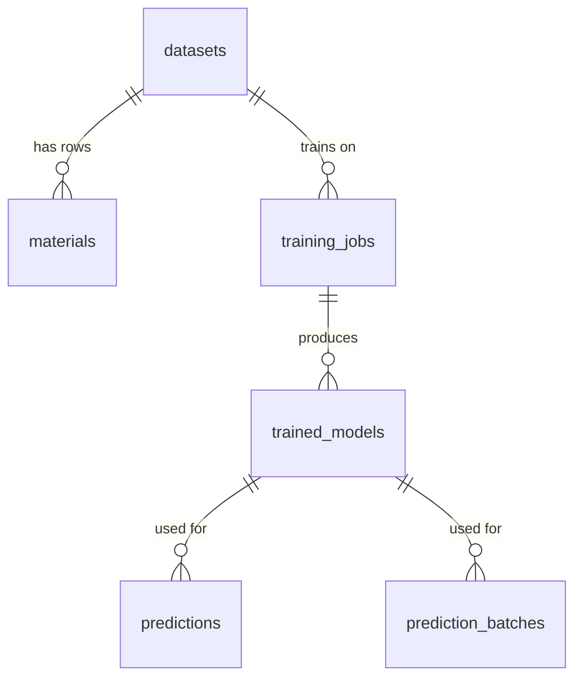

# Piezo.AI v2.1 — Implementation Plan (Part 2: Cross-Cutting, Build Plan & Session Guide)

> **App:** Piezo.AI | **Version:** 2.1.0 | **Updated:** 2026-05-11

---

## 5. Cross-Cutting Requirements

### 5.1 UI/UX Design System

**3 Themes (all must have proper contrast and full visibility):**

| Theme              | Background              | Cards             | Primary            | Text                   | Purpose                                          |
| ------------------ | ----------------------- | ----------------- | ------------------ | ---------------------- | ------------------------------------------------ |
| **Dark** (default) | Deep navy #0D0E1A       | #15162A           | Indigo #4F46E5     | Lavender-white #E8E9FF | Primary working theme                            |
| **Light**          | Soft blue-white #F8F9FE | White #FFFFFF     | Indigo #4F46E5     | Deep navy #1E1B4B      | Daytime use                                      |
| **Night**          | Warm dark #1A1410       | Warm dark #241E18 | Warm amber #D4A053 | Warm cream #F0E6D3     | Eye protection / blue-light filter, warmer tones |

**Chart colors (consistent across themes):** Indigo (d33), Emerald (tc), Amber (hardness), Pink (composite), Violet (pareto)

**UI Responsiveness:**

- **4 breakpoint tiers:**
  - **XL (≥1440px):** Full layout — expanded sidebar, multi-column grids, all panels visible
  - **LG (1080–1439px):** Sidebar collapses to icon-only by default, grids reduce column count
  - **MD (768–1079px):** Single-column layout, stacked cards, icon-only sidebar
  - **SM (<768px):** Mobile layout — sidebar replaced with hamburger menu (top-left), bottom navigation bar for primary sections, stacked vertical layout, draggable grids disabled (static stack), touch-friendly tap targets (min 44px)
- All transitions between breakpoints use smooth CSS transitions (300ms ease)
- Font sizes scale down proportionally at smaller breakpoints
- Charts/graphs resize responsively using container queries where supported
- Tables switch to horizontal scroll on small screens

**Layout & Interaction:**

- Collapsible sidebar: full labels → icon-only mode
- **Draggable grid layout** (react-grid-layout) for: Train, Predict, Interpretability. Purpose: focused workflow — show relevant cards, hide irrelevant ones, expand cards of interest. **Disabled on mobile (<768px)** — falls back to static stacked layout
- **Drag handle:** each card has a `grip-vertical` icon in the header — dragging ONLY works via this handle. Clicking/selecting text anywhere else in the card works normally (copy, select, interact). This prevents drag conflicts with text selection
- **Card resize:** resizable from **bottom-right corner only** (resize handle indicator visible on hover). Corner-only resizing avoids accidental resizes from edge interactions
- **Card drawer:** hidden cards collapse into a **vertical drawer on the right edge** of the page (icon strip). Click or drag & drop a card from the drawer to restore it to the grid. Drawer is scrollable if many cards are hidden. On mobile, hidden cards appear in a bottom sheet instead
- **Reset layout button** per page — restores cards to the default arrangement optimized for that section's content type (e.g., Train defaults to terminal + convergence chart prominent)
- State persistence per section: navigating away and returning preserves current state (training progress, prediction inputs, selected models). Hard page reload resets to defaults
- System online/offline indicator in header
- Theme toggle in header

**Graph Expansion (all charts/graphs across all sections):**

- Expand button on every graph → opens full-window overlay
- Zoom in/out controls, pan/move with arrow keys or drag
- Reset view button
- "Hide controls" button for clean view (for screenshots/presentations)
- Close button to return to normal view

**Animations (Framer Motion):**

- Smooth page transitions
- Card hover effects (subtle lift/glow)
- Gauge fill animations on prediction results
- Loading skeleton states
- Sidebar collapse/expand animation

**Typography:** Inter (body text), JetBrains Mono (code, terminal, formula display)
**Icons:** Lucide React — consistent minimalist line icons throughout
**Components:** Radix UI primitives (Label, RadioGroup, Slider, Slot), shadcn/ui styling patterns
**Charts:** Recharts (primary), D3 (advanced/custom visualizations like SHAP beeswarm)
**Math Notation:** KaTeX for PySR equations display

### 5.1 Development Environment & Version Requirements

> [!IMPORTANT]
> **Python 3.14 is NOT supported.** The `mendeleev` package requires `<3.14`. All Python packages must be installed in a **project-local virtual environment** (`.venv/`), never globally.

**Runtime Versions:**

| Tool | Required Version | Pinned Via | Constraint Reason |
|------|-----------------|-----------|-------------------|
| Python | **3.13.x** (3.11–3.13 accepted) | `.python-version` | mendeleev requires `>=3.9,<3.14` |
| Node.js | **20 LTS** | `.nvmrc` | Next.js 15 requires Node 20+ |
| pnpm | 10+ | `package.json#packageManager` | Monorepo workspace management |
| Docker | Latest | — | PostgreSQL 16 container |

**Version Activation:**
```bash
nvm use              # reads .nvmrc → Node 20
python3.13 -m venv .venv   # create venv with correct Python
source .venv/bin/activate  # activate venv
```

**Virtual Environment Rules:**
- `.venv/` lives at project root (not inside apps/api/)
- All 3 Python packages installed in editable mode: `pip install -e packages/db -e packages/ml-core -e apps/api`
- `dev.sh setup` auto-detects `python3.13` → `python3.12` → `python3.11` (in priority order)
- If existing `.venv` uses an incompatible Python (e.g., 3.14), `dev.sh setup` auto-recreates it
- `.venv/` is in `.gitignore` — each developer creates their own

**`scripts/dev.sh` Commands:**

| Command | Description |
|---------|-------------|
| `setup` | Auto-detect Python, create `.venv`, install all deps, start Docker DB, run migrations |
| `setup:all` | Full clean + fresh install (wipes `.venv`, `node_modules`) |
| `clean` | Remove `.venv`, `node_modules`, `.next`, `__pycache__` |
| `start` | Start Docker DB + FastAPI (8000) + Next.js (3000) with port conflict checks |
| `stop` | Gracefully kill servers + stop Docker container |
| `db:create` | Create the PostgreSQL database |
| `db:reset` | Drop + recreate DB + run migrations (destroys data, requires confirmation) |
| `db:migrate` | Run Alembic migrations only |

**Dependency Lock Files:**
- `requirements.txt` — Combined Python deps for reference/CI
- `pnpm-lock.yaml` — Auto-generated by pnpm (committed to git)
- `pyproject.toml` — Per-package deps with version ranges

### 5.2 Frontend Tech Stack


- Next.js 16, React 19, TailwindCSS 4
- Framer Motion, Recharts, D3, Lucide React, Radix UI
- TanStack React Query (data fetching), TanStack React Table (virtualized tables), TanStack Virtual
- Zustand (state management)
- React Hook Form + Zod (form validation)
- react-grid-layout (draggable layouts), react-dropzone (file upload)
- KaTeX (math), react-markdown
- next-themes (theme switching)

### 5.3 Backend Architecture

- **FastAPI as dumb pipe router:** only HTTP request handling, WebSocket management, request validation (Pydantic), and DB queries
- **All ML logic** in `packages/ml-core/piezo_ml/` — no exceptions
- Implement things in a scalable, robust, easy to maintain, modular and well-documented way. Ensure proper separation of concerns and adhere to software engineering best practices
- **Structured logging** in backend terminal showing complete ML flow (preprocessing, feature engineering, training, prediction)
- **WebSocket** for real-time training log streaming to frontend terminal
- **Background tasks** (FastAPI BackgroundTasks or threading) for long-running training operations
- **CORS** configured for localhost:3000
- Add central version tracker so that we can add version to our app using the env variable. Currently v2.1.0. Add a small label in the footer to display the current version. And a footer that shows my(Developer) github and linkedin urls too.

### 5.4 Backend Tech Stack

- FastAPI, Uvicorn
- SQLAlchemy (async) + asyncpg
- Pydantic Settings
- Alembic (migrations)
- structlog (logging)
- python-multipart (file uploads)
- python-dotenv
- WebSockets

### 5.5 ML Core (packages/ml-core)

- scikit-learn, XGBoost, LightGBM
- Optuna (hyperparameter tuning)
- chemparse, Pymatgen, mendeleev (formula parsing + physics descriptors)
- pandas, numpy
- SHAP (model interpretability)
- pymoo (NSGA-II multi-objective optimization)
- PySR (symbolic regression — requires Julia backend)
- Matminer (advanced feature engineering for hardness)
- ReportLab, Matplotlib (PDF report generation)
- **Deferred:** CHGNet, M3GNet (GNN transfer learning — future enhancement)

### 5.6 Database Schema

PostgreSQL (local or Docker) with SQLAlchemy async + asyncpg + Alembic migrations.

> [!IMPORTANT]
> **This schema is the contract between sessions.** Every session that touches the DB must reference this section. Column names, types, and constraints must match exactly. If a session needs to add a column, update this schema FIRST, then implement.

#### Entity Relationship Diagram



---

#### Table: `datasets`

Stores metadata for each uploaded CSV dataset.

| Column                 | Type           | Constraints | Default                       | Valid Inputs / Notes                                                                                                                                              |
| ---------------------- | -------------- | ----------- | ----------------------------- | ----------------------------------------------------------------------------------------------------------------------------------------------------------------- |
| `id`                   | `UUID`         | PK          | `uuid4()`                     | Auto-generated. **Never changes** even if dataset is renamed. All FK references use this                                                                          |
| `display_name`         | `VARCHAR(255)` | NOT NULL    | Original filename (sans .csv) | User-renameable. Display only — never used as FK or identifier                                                                                                    |
| `original_filename`    | `VARCHAR(255)` | NOT NULL    | —                             | Original uploaded filename, e.g., `knn_bulk_ceramic_dataset.csv`                                                                                                  |
| `status`               | `VARCHAR(20)`  | NOT NULL    | `'pending'`                   | `'pending'` (wizard not completed) \| `'ready'` (wizard completed, data validated)                                                                                |
| `total_rows`           | `INTEGER`      | NOT NULL    | —                             | Count of rows after upload (before any preprocessing). Updated if rows are deleted via CRUD                                                                       |
| `total_columns`        | `INTEGER`      | NOT NULL    | —                             | Count of mapped columns                                                                                                                                           |
| `column_mapping`       | `JSONB`        | NOT NULL    | —                             | `{"original_col_name": "backend_field_name", ...}`. Stored for audit trail, but the actual data columns in `materials` table are already renamed to backend names |
| `has_composite_fields` | `BOOLEAN`      | NOT NULL    | `false`                       | `true` if dataset contains non-zero filler_wt_pct or non-"none" matrix_type                                                                                       |
| `uploaded_at`          | `TIMESTAMP`    | NOT NULL    | `now()`                       | Auto-set on creation                                                                                                                                              |
| `updated_at`           | `TIMESTAMP`    | NOT NULL    | `now()`                       | Auto-updated on any modification                                                                                                                                  |

**Index:** `ix_datasets_status` on `status`

---

#### Table: `materials`

Individual rows of a dataset — the actual data. Column names match backend field names (post-mapping).

| Column                 | Type           | Constraints                                     | Default     | Valid Inputs / Notes                                                                                                                                            |
| ---------------------- | -------------- | ----------------------------------------------- | ----------- | --------------------------------------------------------------------------------------------------------------------------------------------------------------- |
| `id`                   | `UUID`         | PK                                              | `uuid4()`   | Auto-generated row identifier                                                                                                                                   |
| `dataset_id`           | `UUID`         | FK → `datasets.id`, NOT NULL, ON DELETE CASCADE | —           | Which dataset this row belongs to                                                                                                                               |
| `uid`                  | `INTEGER`      | NOT NULL                                        | —           | Sequential from 1 per dataset, based on original upload order. **NOT the same as DB row index.** Used ONLY for source↔parsed traceability. Not used in training |
| `formula`              | `VARCHAR(500)` | NOT NULL                                        | —           | Chemical formula string. Examples: `K0.5Na0.5NbO3`, `(K0.44Na0.52Li0.04)(Nb0.84Ta0.10Sb0.06)O3`, `0.96(K0.48Na0.52)(Nb0.95Sb0.05)O3-0.04Bi0.5Na0.5ZrO3`         |
| `d33`                  | `FLOAT`        | nullable                                        | `NULL`      | Piezoelectric coefficient in pC/N. Ceramic range: 66–680. Composite range: 0–78. Required for training                                                          |
| `tc`                   | `FLOAT`        | nullable                                        | `NULL`      | Curie temperature in °C. Range: 105–458. Required for training. May be blank for composites                                                                     |
| `vickers_hardness`     | `FLOAT`        | nullable                                        | `NULL`      | Vickers hardness HV (kgf/mm²). Range: 38–1200. Optional target                                                                                                  |
| `qm`                   | `FLOAT`        | nullable                                        | `NULL`      | Mechanical quality factor. Range: 50–1500+. Dimensionless                                                                                                       |
| `kp`                   | `FLOAT`        | nullable                                        | `NULL`      | Planar coupling coefficient. Range: 0.30–0.65. Dimensionless                                                                                                    |
| `relative_density_pct` | `FLOAT`        | nullable                                        | `NULL`      | % of theoretical density. Range: 88–99                                                                                                                          |
| `sintering_temp_c`     | `FLOAT`        | nullable                                        | `NULL`      | Peak sintering temperature in °C. Range: 850–1160 for KNN                                                                                                       |
| `sintering_method`     | `VARCHAR(50)`  | nullable                                        | `NULL`      | `conventional` \| `hot_press` \| `sps` \| `rtgg` \| `tgg` \| `two_step` \| `cold_sinter`                                                                        |
| `ceramic_type`         | `VARCHAR(20)`  | nullable                                        | `NULL`      | `soft` \| `hard` \| `composite`                                                                                                                                 |
| `fabrication_method`   | `VARCHAR(50)`  | nullable                                        | `NULL`      | `conventional` \| `hot_press` \| `sps` \| `rtgg` \| `tgg` \| `two_step` \| `electrospinning` \| `solvent_cast` \| `cold_sinter` \| `hot_compression`            |
| `matrix_type`          | `VARCHAR(50)`  | NOT NULL                                        | `'none'`    | `none` (bulk ceramic) \| `pvdf` \| `p_vdf_trfe` \| `pvdf_hfp` \| `pvdf_hfp_ctrfe`                                                                               |
| `filler_wt_pct`        | `FLOAT`        | NOT NULL                                        | `0`         | Weight fraction of ceramic filler. `0` for bulk ceramics. Composite values: 3, 5, 10, 15, 20, 40, 80                                                            |
| `particle_morphology`  | `VARCHAR(30)`  | NOT NULL                                        | `'none'`    | `none` (bulk) \| `spherical` \| `rod` \| `cube` \| `nanoblock` \| `fiber` \| `platelet`                                                                         |
| `particle_size_nm`     | `FLOAT`        | nullable                                        | `NULL`      | Filler particle size in nm. `NULL` for bulk ceramics. Typical: 50–1000                                                                                          |
| `surface_treatment`    | `VARCHAR(30)`  | NOT NULL                                        | `'none'`    | `none` (bulk) \| `untreated` \| `silane` \| `plasma` \| `acid` \| `peg` \| `dopamine`                                                                           |
| `source_doi`           | `VARCHAR(500)` | nullable                                        | `NULL`      | DOI URL or Materials Project URL                                                                                                                                |
| `source_notes`         | `TEXT`         | nullable                                        | `NULL`      | Free text: "Journal Year - key result"                                                                                                                          |
| `parse_status`         | `VARCHAR(30)`  | NOT NULL                                        | `'pending'` | `'pending'` \| `'success'` \| `'error'` \| `'unsupported_elements'`                                                                                             |
| `parse_warnings`       | `TEXT`         | nullable                                        | `NULL`      | Comma-separated warnings from formula parser                                                                                                                    |
| `source_row`           | `JSONB`        | nullable                                        | `NULL`      | **S2 hardening:** source snapshot of row values (pre-normalization) for true Source vs Parsed comparison and revalidation workflows                              |
| `parsed_row`           | `JSONB`        | nullable                                        | `NULL`      | **S2 hardening:** normalized/validated snapshot (e.g., normalized formula + parse status/warnings) for comparison and audit trail                               |
| `created_at`           | `TIMESTAMP`    | NOT NULL                                        | `now()`     | Auto-set                                                                                                                                                        |
| `updated_at`           | `TIMESTAMP`    | NOT NULL                                        | `now()`     | Auto-updated on CRUD edits                                                                                                                                      |

**Indexes:**

- `ix_materials_dataset_id` on `dataset_id`
- `ix_materials_uid` on `(dataset_id, uid)` UNIQUE — ensures uid is unique within a dataset
- `ix_materials_formula` on `formula` (for search)

**Bulk ceramic detection rule:** `filler_wt_pct = 0 AND matrix_type = 'none'` → bulk ceramic. Otherwise → composite.

> **Edit safety rule (S2 hardening):** Any successful mutation (edit/add/delete/column clear) on a dataset that is `ready` must flip it back to `pending` so the user re-runs Review Issues and re-finalizes. Backend must validate user edits before commit (numeric types, categorical allowed values, formula re-validation) to prevent silently breaking preprocessing expectations.

> **Composite consistency rule (S2 hardening):** user edits must satisfy strict row consistency:
> - Bulk: `matrix_type='none'` and `filler_wt_pct=0`
> - Composite: `matrix_type!='none'` and `filler_wt_pct>0`
> - Composite-compulsory descriptors during edits: `particle_morphology`, `particle_size_nm`, `surface_treatment`
> Invalid updates are rejected with machine-readable reason and surfaced in themed UI notices.

> **Review column-remediation guardrails (S2 hardening):** Review Issues supports multi-column clear actions with select-all/deselect-all controls. `uid` and `formula` are protected (non-clearable), and the operation is blocked when it would remove all available target metrics among `d33`, `tc`, and `vickers_hardness`.
> Clear writes normalized missing/sentinel values by type: nullable fields to `NULL`, composite sentinel categoricals to `none`, and `filler_wt_pct` to `0` (bulk fallback). UI may display `NULL` as `—`; this representation must remain training-safe.

> **Search/visibility consistency rule (S2 hardening):** in comparison tables, search matching must run on the intersection of selected **Search In** fields and currently visible columns, so every returned row contains at least one visible matched cell.

> **Pagination/state consistency rule (S2 hardening):** page size selection is state-driven and shared with table/query state (search/sort/page), preventing count mismatch and broken next/prev navigation.

> **Central notice component rule (S2 hardening):** validation and workflow messages should use the shared modular notice banner component to keep tone, style, and error detail behavior consistent across dataset views.

---

#### Table: `training_jobs`

Tracks training pipeline execution status (for queue, progress bar, stop button).

| Column            | Type           | Constraints                  | Default    | Valid Inputs / Notes                                                                                                                               |
| ----------------- | -------------- | ---------------------------- | ---------- | -------------------------------------------------------------------------------------------------------------------------------------------------- |
| `id`              | `UUID`         | PK                           | `uuid4()`  |                                                                                                                                                    |
| `dataset_id`      | `UUID`         | FK → `datasets.id`, NOT NULL | —          | Dataset used for this training run                                                                                                                 |
| `status`          | `VARCHAR(20)`  | NOT NULL                     | `'queued'` | `'queued'` \| `'running'` \| `'completed'` \| `'failed'` \| `'cancelled'`                                                                          |
| `mode`            | `VARCHAR(10)`  | NOT NULL                     | `'manual'` | `'manual'` (user sets params) \| `'auto'` (Optuna-tuned)                                                                                           |
| `targets`         | `JSONB`        | NOT NULL                     | —          | List of target columns: `["d33", "tc"]` or `["d33", "tc", "vickers_hardness"]`                                                                     |
| `algorithms`      | `JSONB`        | NOT NULL                     | —          | Target → algorithm mapping: `{"d33": "xgboost", "tc": "random_forest"}`                                                                            |
| `hyperparameters` | `JSONB`        | nullable                     | `NULL`     | Per-target params: `{"d33": {"n_estimators": 100, "max_depth": 6}, ...}`                                                                           |
| `selected_fields` | `JSONB`        | NOT NULL                     | —          | List of input fields used: `["formula", "d33", "tc", "sintering_temp_c", ...]`                                                                     |
| `progress_pct`    | `FLOAT`        | NOT NULL                     | `0`        | 0.0–100.0. Updated per ML stage. Drives the frontend progress bar                                                                                  |
| `current_stage`   | `VARCHAR(100)` | nullable                     | `NULL`     | Human-readable: `'Splitting train/test'`, `'Cleaning data'`, `'Engineering features'`, `'Training xgboost for d33'`, etc. Shown above progress bar |
| `initial_rows`    | `INTEGER`      | nullable                     | `NULL`     | Row count at start of preprocessing                                                                                                                |
| `initial_columns` | `INTEGER`      | nullable                     | `NULL`     | Column count at start                                                                                                                              |
| `final_rows`      | `INTEGER`      | nullable                     | `NULL`     | Row count after preprocessing (dropped rows logged)                                                                                                |
| `final_columns`   | `INTEGER`      | nullable                     | `NULL`     | Feature dimension after engineering                                                                                                                |
| `artifact_dir`    | `VARCHAR(500)` | nullable                     | `NULL`     | Path to `resources/training-artifacts/dataset_<id>_<timestamp>/`                                                                                   |
| `error_message`   | `TEXT`         | nullable                     | `NULL`     | Error details if status='failed'                                                                                                                   |
| `started_at`      | `TIMESTAMP`    | nullable                     | `NULL`     | Set when status changes to 'running'                                                                                                               |
| `completed_at`    | `TIMESTAMP`    | nullable                     | `NULL`     | Set when status changes to 'completed'/'failed'/'cancelled'                                                                                        |
| `created_at`      | `TIMESTAMP`    | NOT NULL                     | `now()`    |                                                                                                                                                    |

**Index:** `ix_training_jobs_status` on `status`, `ix_training_jobs_dataset_id` on `dataset_id`

**Valid algorithm values:** `xgboost` \| `random_forest` \| `svr` \| `lightgbm` \| `gradient_boosting` \| `decision_tree` \| `ann` \| `stacking`

---

#### Table: `trained_models`

Stores metadata for each trained model (one row per target per training job).

| Column                | Type           | Constraints                       | Default                                       | Valid Inputs / Notes                                                               |
| --------------------- | -------------- | --------------------------------- | --------------------------------------------- | ---------------------------------------------------------------------------------- |
| `id`                  | `UUID`         | PK                                | `uuid4()`                                     | **Never changes** even if model is renamed                                         |
| `display_name`        | `VARCHAR(255)` | NOT NULL                          | Auto-generated: `{algorithm}_{target}_{date}` | User-renameable. Display only — UUID is the real identifier                        |
| `training_job_id`     | `UUID`         | FK → `training_jobs.id`, NOT NULL | —                                             | Which training job produced this model                                             |
| `dataset_id`          | `UUID`         | FK → `datasets.id`, NOT NULL      | —                                             | Source dataset (for download parsed dataset feature)                               |
| `target`              | `VARCHAR(30)`  | NOT NULL                          | —                                             | `'d33'` \| `'tc'` \| `'vickers_hardness'`                                          |
| `algorithm`           | `VARCHAR(30)`  | NOT NULL                          | —                                             | Same valid values as training_jobs.algorithms                                      |
| `r2_score`            | `FLOAT`        | NOT NULL                          | —                                             | R² on test set. Range: -∞ to 1.0 (typically 0.5–0.99)                              |
| `rmse`                | `FLOAT`        | NOT NULL                          | —                                             | Root Mean Square Error on test set                                                 |
| `hyperparameters`     | `JSONB`        | NOT NULL                          | —                                             | Final hyperparameters used (may differ from request if Optuna-tuned)               |
| `feature_version`     | `VARCHAR(10)`  | NOT NULL                          | —                                             | Feature engineering version tag, e.g., `'v4'`                                      |
| `feature_dim`         | `INTEGER`      | NOT NULL                          | —                                             | Number of features in the input vector                                             |
| `n_train_samples`     | `INTEGER`      | NOT NULL                          | —                                             | Training set size                                                                  |
| `n_test_samples`      | `INTEGER`      | NOT NULL                          | —                                             | Test set size                                                                      |
| `supported_elements`  | `JSONB`        | NOT NULL                          | —                                             | List of elements supported by this model: `["K", "Na", "Nb", "O", ...]`            |
| `model_file_path`     | `VARCHAR(500)` | NOT NULL                          | —                                             | Relative path: `resources/trained-models/model_d33_xgboost_20260507_143022.joblib` |
| `artifact_dir`        | `VARCHAR(500)` | NOT NULL                          | —                                             | Path to training-artifacts dir for this model's dataset                            |
| `training_duration_s` | `FLOAT`        | NOT NULL                          | —                                             | Training wall-clock time in seconds                                                |
| `is_default`          | `BOOLEAN`      | NOT NULL                          | `false`                                       | Only ONE model per target should be `true`. Enforced in application logic          |
| `created_at`          | `TIMESTAMP`    | NOT NULL                          | `now()`                                       |                                                                                    |

**Indexes:**

- `ix_trained_models_target` on `target`
- `ix_trained_models_dataset_id` on `dataset_id`
- `ix_trained_models_is_default` on `(target, is_default)` — for quick default lookup

---

#### Table: `predictions`

Stores individual prediction history (single formula predictions + individual batch rows).

| Column               | Type           | Constraints                            | Default   | Valid Inputs / Notes                                                                                                                                                             |
| -------------------- | -------------- | -------------------------------------- | --------- | -------------------------------------------------------------------------------------------------------------------------------------------------------------------------------- |
| `id`                 | `UUID`         | PK                                     | `uuid4()` |                                                                                                                                                                                  |
| `model_id`           | `UUID`         | FK → `trained_models.id`, NOT NULL     | —         | Which model made this prediction                                                                                                                                                 |
| `batch_id`           | `UUID`         | FK → `prediction_batches.id`, nullable | `NULL`    | `NULL` for single predictions. Set for batch predictions                                                                                                                         |
| `formula`            | `VARCHAR(500)` | NOT NULL                               | —         | Input formula string                                                                                                                                                             |
| `is_composite`       | `BOOLEAN`      | NOT NULL                               | `false`   | `true` if composite fields are non-default                                                                                                                                       |
| `composite_params`   | `JSONB`        | nullable                               | `NULL`    | `{"matrix_type": "pvdf", "filler_wt_pct": 10, "particle_morphology": "spherical", "particle_size_nm": 100, "surface_treatment": "silane", "fabrication_method": "solvent_cast"}` |
| `d33_predicted`      | `FLOAT`        | nullable                               | `NULL`    | Predicted d33 in pC/N. NULL if model doesn't predict d33 or prediction failed                                                                                                    |
| `d33_ci_lower`       | `FLOAT`        | nullable                               | `NULL`    | 95% CI lower bound                                                                                                                                                               |
| `d33_ci_upper`       | `FLOAT`        | nullable                               | `NULL`    | 95% CI upper bound                                                                                                                                                               |
| `tc_predicted`       | `FLOAT`        | nullable                               | `NULL`    | Predicted Tc in °C                                                                                                                                                               |
| `tc_ci_lower`        | `FLOAT`        | nullable                               | `NULL`    | 95% CI lower bound                                                                                                                                                               |
| `tc_ci_upper`        | `FLOAT`        | nullable                               | `NULL`    | 95% CI upper bound                                                                                                                                                               |
| `hardness_predicted` | `FLOAT`        | nullable                               | `NULL`    | Predicted Vickers hardness in HV                                                                                                                                                 |
| `hardness_ci_lower`  | `FLOAT`        | nullable                               | `NULL`    | **S5:** 95% CI lower bound for hardness (computed via ensemble tree std dev)                                                                                                      |
| `hardness_ci_upper`  | `FLOAT`        | nullable                               | `NULL`    | **S5:** 95% CI upper bound for hardness                                                                                                                                          |
| `prediction_status`  | `VARCHAR(30)`  | NOT NULL                               | —         | `'success'` \| `'unsupported_elements'` \| `'parse_error'`                                                                                                                       |
| `prediction_notes`   | `TEXT`         | nullable                               | `NULL`    | Error details if status ≠ 'success'                                                                                                                                              |
| `created_at`         | `TIMESTAMP`    | NOT NULL                               | `now()`   |                                                                                                                                                                                  |

**Indexes:**

- `ix_predictions_model_id` on `model_id`
- `ix_predictions_batch_id` on `batch_id`
- `ix_predictions_formula` on `formula` (for prediction history search)

---

#### Table: `prediction_batches`

Stores metadata for batch prediction jobs (CSV upload → predict all rows).

| Column             | Type           | Constraints                        | Default   | Valid Inputs / Notes                                  |
| ------------------ | -------------- | ---------------------------------- | --------- | ----------------------------------------------------- |
| `id`               | `UUID`         | PK                                 | `uuid4()` |                                                       |
| `model_id`         | `UUID`         | FK → `trained_models.id`, nullable | `NULL`    | **Deprecated (S5):** kept for backward compat. Use `model_ids` for multi-target batch |
| `model_ids`        | `JSONB`        | nullable                           | `NULL`    | **S5:** Per-target model IDs: `{"d33": "uuid", "tc": "uuid", "vickers_hardness": "uuid"}`. Each target is independently selectable |
| `source_filename`  | `VARCHAR(255)` | NOT NULL                           | —         | Original uploaded CSV filename                        |
| `total_rows`       | `INTEGER`      | NOT NULL                           | —         | Total rows in the uploaded CSV                        |
| `success_count`    | `INTEGER`      | NOT NULL                           | `0`       | Rows predicted successfully                           |
| `error_count`      | `INTEGER`      | NOT NULL                           | `0`       | Rows that failed (unsupported elements, parse errors) |
| `result_file_path` | `VARCHAR(500)` | nullable                           | `NULL`    | Path to output CSV with predictions appended          |
| `created_at`       | `TIMESTAMP`    | NOT NULL                           | `now()`   |                                                       |

**Index:** `ix_prediction_batches_model_id` on `model_id`

---

#### Cross-Table Rules & Constraints

| Rule                             | Description                                                                                                                                                                                                 |
| -------------------------------- | ----------------------------------------------------------------------------------------------------------------------------------------------------------------------------------------------------------- |
| **UUID as primary identifier**   | All tables use UUID as PK. Renaming a dataset/model updates `display_name` only — all FKs reference the immutable UUID                                                                                      |
| **Cascade delete**               | Deleting a dataset cascades to: materials → training_jobs → trained_models → predictions. User must confirm in Danger Zone                                                                                  |
| **Default model uniqueness**     | Only one `trained_model` per `target` can have `is_default = true`. Setting a new default must unset the old one (application-level logic)                                                                  |
| **uid uniqueness**               | `(dataset_id, uid)` is unique. uid is assigned sequentially (1, 2, 3...) at upload time and never changes — even if rows are later deleted via CRUD, existing uids are NOT reassigned                       |
| **Bulk ceramic sentinel values** | If `filler_wt_pct = 0`, then `matrix_type` MUST be `'none'`, `particle_morphology` MUST be `'none'`, `surface_treatment` MUST be `'none'`, `particle_size_nm` MUST be `NULL`. Enforced in application logic |
| **Prediction history**           | All single and batch predictions are stored and never auto-deleted. Used for report generation (user selects from history)                                                                                  |

### 5.7 Optional/Deferred Features

| Feature                      | Status   | Notes                                                                                                                      |
| ---------------------------- | -------- | -------------------------------------------------------------------------------------------------------------------------- |
| AI Agent (LangGraph chat)    | Deferred | Implement only after ALL core features work. LangGraph + LangChain + tool-calling for predict, search, compare, explain    |
| Voice Interaction            | Deferred | Part of Agentic AI system. Real-time voice chat with AI, tool calls, process animations, waiting states. After Agent works |
| GNN/CHGNet Transfer Learning | Future   | Heavy deps (PyTorch). v2.1 uses Pymatgen-based structural analysis instead                                                 |

---

## 6. Session-by-Session Build Sequence (10 Sessions)

| Session | Feature                                                                                                                                                                                                                                                                           | Dependencies | Estimated Scope                                                                                                             |
| ------- | --------------------------------------------------------------------------------------------------------------------------------------------------------------------------------------------------------------------------------------------------------------------------------- | ------------ | --------------------------------------------------------------------------------------------------------------------------- |
| **S0**  | Cleanup + Scaffold monorepo + DB setup + dev scripts                                                                                                                                                                                                                              | —            | Delete old code, scaffold structure, pyproject.toml, package.json, turbo.json, pnpm-workspace, docker-compose, alembic init |
| **S1**  | Layout Shell: Sidebar, Header, ThemeProvider (dark/light/night), AppShell, routing for all 7 pages                                                                                                                                                                                | S0           | Frontend only — all pages show placeholder content                                                                          |
| **S2**  | Dataset Upload: full pipeline (upload, map columns, review issues with CRUD, dataset explorer with uid, formula validation at upload)                                                                                                                                             | S0-S1        | Backend (dataset module + DB models) + Frontend (wizard, table, search)                                                     |
| **S3**  | ML-Core Foundation: **Central Element Registry** (33 elements, 27+ properties, auto-bootstrap), formula parsers, feature engineering, field registry, parsed dataset saver, data preprocessing                                                                                    | S0           | Python only — no API, no frontend. Unit-testable modules                                                                    |
| **S4**  | Train: full pipeline (config UI, preprocessing, real-time progress bar, stop with backend propagation, terminal streaming, convergence, results) + **model artifact storage** (resources/trained-models/) + **parsed dataset snapshots** with uid (resources/training-artifacts/) | S2-S3        | Backend (training module + WebSocket) + Frontend (all train components)                                                     |
| **S5**  | Predict: unified (formula input, composite fields, hardness, **multi-target batch with model_ids dict**, comparison, **usage prediction engine with 11 categories**, report) + **strict formula validation** (charset, bracket, token rules with toggle) + **batch tabular preview** + **hardness 95% CI** + element validation error handling + clean CSV output                                                                                    | S3-S4        | Backend (prediction module) + Frontend (all predict components)                                                             |
| **S6**  | Dashboard: stats, quick actions, model management (rename/uuid/download parsed dataset), default model, premium PDF report generation with prediction grouping, parsed dataset comparison on-demand                                                                                                                                             | S2-S5        | Backend (system stats endpoints) + Frontend (dashboard page)                                                                |
| **S7**  | Interpretability: SHAP (beeswarm, waterfall, dependence), Physics Validation, Symbolic Regression (PySR)                                                                                                                                                                          | S3-S4        | Backend (interpret module) + Frontend (chart components)                                                                    |
| **S8**  | Optimization Lab: structural analysis + NSGA-II optimization + Pareto front + use-case mapping                                                                                                                                                                                    | S3-S4        | Backend (optimization module) + Frontend (optimization page)                                                                |
| **S9**  | Settings + Polish: settings page, **responsive design** (4 breakpoints), draggable grid fixes (drag-handle, corner-resize, card drawer), graph zoom/expand, state persistence, all 3 themes, animations, final QA                                                                 | S0-S8        | Full integration pass + visual polish                                                                                       |

---

## 7. Verification Plan

### Per-Session Testing

- **Backend:** start API (`uvicorn`), test endpoints with curl or httpie, verify JSON responses
- **Frontend:** visual check in browser (user does manually — guide provided per session)
- **ML Core:** unit tests with `pytest` using sample datasets from `resources/`
- **No automated browser testing** — saves AI tokens. User verifies UI manually with provided step-by-step guide

### End-to-End Verification (after S5)

1. Upload `resources/sample-and-test-dataset/sample_knn_basic.csv` → map columns → verify in explorer
2. Train RandomForest on d33+tc → verify convergence chart + terminal logs + results (R² > 0.7)
3. Predict KNbO3 → verify d33≈66, tc≈435 (within reasonable range)
4. Upload `resources/sample-and-test-dataset/sample_full_complete.csv` → train with composite fields → predict composite material → verify output

### Permission & Retry Failure Policy

> [!IMPORTANT]
> **If any command fails due to permission errors, filesystem restrictions, or similar system-level issues:**
>
> 1. Do NOT retry automatically — this wastes AI tokens
> 2. Instead, provide the user with a clear, copy-pasteable command and explanation
> 3. User will run the command manually and confirm completion
> 4. Then resume implementation from that point
>
> **Same applies to:** npm install failures, pip install failures, Docker permission issues, port conflicts, etc.

---

## 8. Session Prompt Template

> [!TIP]
> Copy-paste the prompt below at the start of **every new** Piezo.AI implementation session. Replace the `[PLACEHOLDERS]` with the actual values before sending.

```
I am working on Piezo.AI v2.1 — a full-stack ML application for AI-driven discovery of lead-free piezoelectric materials.

**Session:** S[NUMBER] — [FEATURE NAME from session-tracker.md]

**Reference Files — read ALL three before writing any code:**
- @[Project/01-architecture-and-sections.md] — monorepo structure, all 7 section feature specs, central element registry design, formula parsing strategy, artifact storage, error handling
- @[Project/02-cross-cutting-and-build-plan.md] — 3 themes (dark/light/night-warm), UI/UX rules, full tech stack, 10-session build sequence, verification plan, permission failure policy, files to retain/delete
- @[Project/session-tracker.md] — current progress, per-session task checklists with what's done and what's pending
 - Database schema reference for implementation consistency: resources/sample-and-test-dataset/material_schema_reference.csv

> (also refer these files: architecture-and-sections.md and cross-cutting-and-build-plan.md for more details/information about the specific section during the implementation of each feature)

**Architecture Rules (non-negotiable):**
1. FastAPI is a DUMB PIPE — zero ML logic in apps/api/. ALL ML computations, model loading, formula parsing, feature engineering, and training live exclusively in packages/ml-core/piezo_ml/
2. Central Element Registry (packages/ml-core/piezo_ml/registry/element_registry.py) is the SINGLE SOURCE OF TRUTH for supported elements — parser, validator, feature engineer, and API all reference it. New elements added via PENDING_ELEMENTS + auto-bootstrap on startup
3. n_jobs=1 for all tree-based ML models on macOS (prevents OpenMP segfaults). Handle fork-vs-spawn and similar multiprocessing issues. Cross-platform: macOS + Windows 11 + Linux
4. 3 Themes: dark (primary, deep navy), light (blue-white), night (warm amber for eye protection)
5. Parsed datasets saved to resources/training-artifacts/ and trained models to resources/trained-models/ with timestamp-based naming
6. All datasets and models use UUID as primary identifier — renaming updates display name only, UUID never changes
7. Datasets saved in DB with column names renamed to backend field names after mandatory column mapping
8. uid column (sequential from 1) assigned at dataset save — used for source-to-parsed row traceability, NOT for training
9. Python 3.13 in .venv/ (NOT 3.14 — mendeleev requires <3.14). Node 20 via nvm. All pip installs in venv, never global. Use `source .venv/bin/activate` before any Python command

**Guidelines:**
- Do NOT write any mock/placeholder data — everything must be functional and actually work
- Do NOT include any implementation details from the old broken codebase — write fresh, clean code following the plan
- Since LLMs have max token generation limit so what you can do is split the implementation plan in to multiple files for specific S[Replace with current work number for this session] and save the markdown file inside the "Project" folder and in antigravity main implementation plan just refer these files and a slight overview of work. By this way we can bypass mac token generation limit.
- **STRICT NO-RETRY POLICY:** If any command fails due to permissions, filesystem restrictions, git config, npm/pip install failures, Docker permission issues, port conflicts, or similar system-level issues: do NOT retry automatically — this wastes limited AI tokens. Instead, provide a clear copy-pasteable command and explanation. The user will run it manually and confirm completion, then you continue. Absolutely NO multiple failed retries of the same command type.
- No automated browser testing — I will verify UI manually. If needed, provide a step-by-step guide for what to check
- Handle unsupported elements gracefully with friendly user-facing messages (see §7 in 01-architecture-and-sections.md)
- Formula validation runs during dataset upload (Review Issues step) so users can fix issues before training
- S4 preprocessing must explicitly handle S2-cleared values (`NULL` / `none` / bulk sentinels) through user-selected per-field strategies (KNN/mean/median/mode/drop), with train/test-safe policy and pre-training validation checks.
- Training progress bar must reflect real ML stage completion, stop button must propagate to backend process
- [Strictly] Ensure any new codebase single file do not becomes too large, such that it exceed maximum generation limit and which may cause issue in analysis too in future(which will cause max token limit for generation and issue for future analysis, so max ~400 lines if it exceeds then make split with modular approach in multiple files, +50 lines only acceptable in case of special conditions) then split its implementation in logical modular parts in multiple files and document that in the final checklist: session-tracker.md and if required to update to make everything in sync then also update our master implementation plan to ensure no regression in implementation: 01-architecture-and-sections.md, 02-cross-cutting-and-build-plan.md . But if splitting in mutiple files does not affect the implementation plan cause it does not have much technical details mentioned then skip it, update it only if it mentions it.
- [Moderately] If there is any existing large codebase file then try to split them in multiple modular and resuable components files so that its easy to maintain and debug, while verifying and ensuring any does not break/no issue/does not remain partially implemented after this fix.

**End-of-Session Reverification Rule:**
- Before finalizing and notifying the user of completion, re-analyze the plans (01-architecture-and-sections.md, 02-cross-cutting-and-build-plan.md, session-tracker.md) vs the current codebase implementation
- Ensure everything is done up to the current session S[N], without any partial, buggy, or broken implementation issues
- If issues are found, fix them properly (not temporary patches) within the scope of up to the current session
- Only after confirming all tasks are complete and verified, provide the git commit message for the user to push via GitHub Desktop

**Previous sessions completed:** [LIST COMPLETED SESSIONS, e.g., "S0, S1, S2"]

**This session goal:** [DESCRIBE WHAT TO BUILD — refer to the session-tracker.md checklist items for this session]

**Session Tracker Update Rule:**
- Do NOT update session-tracker.md during the session
- Only update it at the very END when I explicitly tell you: "session is done, update tracker"
- When I give that permission, mark completed tasks as [x], note any blockers in the Issues Log, and update the session status row
- If I don't give that permission, do NOT touch session-tracker.md
```

---

## 9. Files to RETAIN During Cleanup (Session S0)

**Keep:**

- `.env`, `.env.example`, `.gitignore`
- `synopsis_6thsem_2026.md`
- `AI Piezoelectric Project Expansion Ideas - 6th sem.txt`
- `Final Report 5th sem AI Assisted Piezoelectric Discovery.txt`
- `Project/` folder (plans, tracker)
- `resources/` folder (datasets, schema, interface previews, sample data)

**Delete everything else:**

- `apps/`, `packages/`, `docker/`, `docs/`, `data/`, `old-codebase/`, `scripts/`
- `node_modules/`, `pnpm-lock.yaml`, `pnpm-workspace.yaml`
- `package.json`, `turbo.json`
- Root test files: `test_db.py`, `test_mapping.py`, `test_predict.py`, `test_train.py`, `add_column.py`
- `README.md`, `handoff_prompt.md`, `project_status_summary.md`, `NEXT_SESSION_PROMPT.md`, `SETUP_GUIDE-old.md`
- `.python-version`
