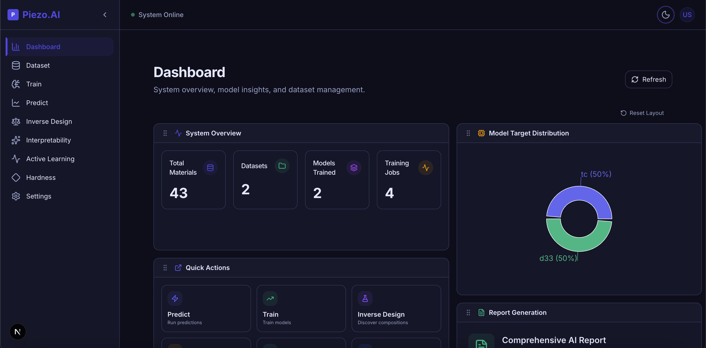
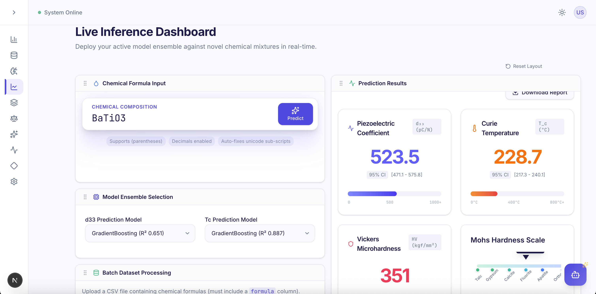

# 🧪 Piezo.AI — AI-Driven Discovery of Lead-Free Piezoelectrics


## 📖 Overview

**Piezo.AI** is a full-stack Materials Informatics platform that uses machine learning to accelerate the discovery of high-performance, lead-free piezoelectric materials. It replaces months of traditional trial-and-error experimentation with millisecond predictions.

<div align="center">
  
  <br/><br/>
  
  <br/><br/>
  <p><em>Early Interface Framework Preview. See <a href="docs/COMPREHENSIVE_GUIDE.md">Comprehensive Guide</a> for the full gallery.</em></p>
</div>

## 🌍 The Problem: The "Lead Dilemma"

**Lead Zirconate Titanate (PZT)** powers nearly all modern piezoelectric devices (ultrasound, sensors, actuators). However, PZT creates a significant global challenge containing >60% lead by weight, an environmental neurotoxin. Finding eco-friendly alternatives is an optimization nightmare due to the practically infinite chemical search space and slow experimental synthesis.

## 💡 The Solution

This project implements a **Data-Driven Workflow** to bypass traditional limitations. We developed a robust chemical parser to convert complex chemical formulas into numerical features, applying adaptive ensemble learning algorithms to accurately predict functional properties of KNN-based piezoelectric materials.
### Synopsis Objectives (6th Semester)

| # | Objective | Status |
|---|-----------|--------|
| 1 | **Domain Expansion** — Augment KNN dataset with PVDF-KNN composite data | ✅ Backend ready |
| 2 | **Mechanical Property Prediction** — ML models for hardness (Vickers/Mohs) | ✅ Backend ready |
| 3 | **Model Transparency** — SHAP explainability | 🔜 Future work |
| 4 | **Structural Analysis AI** — Pre-trained models for crystal structures | 🔜 Future work |

---

## 🚀 Features

### Core Platform
- **Advanced Stoichiometry Engineering** — Robust chemical parsing engine handling nested structures, automatically mapping formulas to 28+ fundamental atomic descriptors.
- **Adaptive Machine Learning Pipeline** — Dual Training Mode: Auto-Intelligent (runs Grid Search across Random Forest, XGBoost, LightGBM, SVR) vs. Expert Manual tuning with stacking regressors and strict parameter sanitization.
- **Real-Time Training Terminal** — Live log streaming via SSE to the browser terminal.
- **Instant & Batch Prediction** — Predict d33 and Tc from formulas in milliseconds, or upload CSV files for bulk analytics.
- **Automated Research Reporting** — Generating publication-ready dynamic visualizations (scatter plots, perfect fit lines) leveraging advanced Flowable logic to export seamless PDF reports.
- **Interactive Custom UI** — Figma-inspired layout utilizing a customized, draggable grid system. Researchers can freely drag, reorder, collapse, or specifically hide unrelated component cards to maintain absolute focus on relevant data streams.

### Extended Capabilities
- **PVDF Composite Prediction** — Predict properties of flexible ceramic-polymer composites with configurable filler %, morphology, and interfacial processing methods.
- **Hardness Prediction & Use-Case Mapping** — Vickers/Mohs hardness estimation with automatic industrial application classification.
- **Interactive Dataset Management** — Upload, view, and manage training datasets seamlessly via the web UI.
- **Model Registry** — Track all trained models with performance metrics, allowing one-click activation of top performers.

## 🔬 Scientific Validation Methodology

To ensure valid scientific outputs, the models follow a rigorous protocol:
1. **Data Cleaning:** Removal of non-stoichiometric entries and duplicate formulas.
2. **Stratified Split:** 80/20 Train-Test split to preserve the distribution of the target properties.
3. **Metric Evaluation:** Models are stringently evaluated on $R^2$ (variance explained) and RMSE.
4. **Target Scaling:** Handled non-normal distributions in target variables (like $T_c$ and $d_{33}$) via `TransformedTargetRegressor`.

### Future Exploration & Expansions
- **Democratizing Deep Learning** — Utilizing Graph Neural Network (GNN) transfer learning (via pre-trained universal foundation models like CHGNet and ALIGNN) functioning as advanced geometric feature extractors on smaller datasets. 
- **Shattering the Black Box (Interpretability)** — Implementing SHAP (Shapley Additive Explanations) for deep feature attribution in tree-based models, and integrating Symbolic Regression (PySR/SISSO) to explicitly derive novel, physically interpretable mathematical equations for piezoelectric behaviors.
- **Multi-Objective Optimization (MOO)** — Applying NSGA-II or Multi-Objective Bayesian Optimization (MOBO) algorithms to establish dynamic 3D Pareto Fronts spanning $d_{33}$, $T_c$, and Mechanical Hardness.
- **Simulated Autonomous Discovery** — Engineering closed-loop Active Learning networks to mathematically navigate the exploitation-exploration trade-off, efficiently steering experimental researchers directly toward optimal regions of the chemical search space.

---

## 🛠️ Technology Stack

| Layer | Technology | Usage |
| :--- | :--- | :--- |
| **Frontend** | **Next.js 14** | React framework with App Router |
| | **Shadcn/UI** | Modern, customizable component library |
| | **TypeScript** | Type-safe frontend code |
| **Backend** | **FastAPI** | High-performance async Python web framework |
| | **PostgreSQL** | Relational database (datasets, jobs, model artifacts) |
| | **Alembic** | Database migrations |
| **ML / Data** | **scikit-learn** | Pipeline construction and preprocessing |
| | **XGBoost / LightGBM** | Advanced gradient boosting implementations |
| | **Joblib** | Model serialization |
| **Infrastructure**| **Docker** | Optional containerized setup |
| | **pnpm** | Extremely fast and strict dependency management |

---

## 💻 Local Development Setup

### Prerequisites

| Tool | Version | Purpose |
|------|---------|---------|
| **Python** | 3.10+ | Backend & ML |
| **Node.js** | 18+ | Frontend |
| **PostgreSQL** | 14+ | Database |
| **pnpm** | 8+ | **Strictly Required** for dependencies |

### Quick Setup

```bash
# 1. Clone the repository
git clone https://github.com/ARYANKUMAR1/Piezoelectrics-AI-Discovery-Lab.git
cd Piezoelectrics-AI-Discovery-Lab

# 2. Run the setup script (use `setup:all` for a fresh start with cleanup)
bash scripts/dev.sh setup

# 3. Start development servers (must run from project root!)
bash scripts/dev.sh start
```

### Manual Setup (Step-by-Step)

> **⚠️ Important:** All commands below must be run from the **project root** directory (`Piezoelectrics-AI-Discovery-Lab/`) unless stated otherwise.

#### 1. Environment Variables
```bash
# 📂 Run from: project root
cp .env.example .env
# Edit .env with your PostgreSQL credentials if different from defaults
```

#### 2. Backend Setup (Python + venv)
```bash
# 📂 Run from: project root
python3 -m venv apps/api/.venv
source apps/api/.venv/bin/activate  # macOS/Linux
# apps\api\.venv\Scripts\activate   # Windows

# 📂 Run from: project root (with venv activated)
pip install -e apps/api
pip install -e packages/ml-core
pip install -e packages/db
```

#### 3. Node.js Setup (using nvm)
```bash
# 📂 Run from: project root
# Install nvm (if not installed)
curl -o- https://raw.githubusercontent.com/nvm-sh/nvm/v0.39.7/install.sh | bash

# Install and use Node 18+
nvm install 18
nvm use 18

# 🛑 Install pnpm (STRICTLY REQUIRED, npm/yarn are blocked)
npm install -g pnpm

# Install dependencies
pnpm install
```

#### 4. Database Setup
```bash
# 📂 Run from: project root

# Option A: Local PostgreSQL
createdb piezo_ai  # or use pgAdmin

# Option B: Docker PostgreSQL
docker compose -f docker/docker-compose.dev.yml up -d

# Run migrations
bash scripts/dev.sh db:migrate
```

#### 5. Start Development
```bash
# 📂 Terminal 1 — Backend (from project root)
source apps/api/.venv/bin/activate
uvicorn apps.api.app.main:app --reload --port 8000

# 📂 Terminal 2 — Frontend (from apps/web/)
cd apps/web
npm run dev
```

| Service | URL |
|---------|-----|
| Web App | http://localhost:3000 |
| API Docs | http://localhost:8000/docs |
| Health Check | http://localhost:8000/api/v1/health |

## 📑 Extended Documentation & UI Gallery

> To keep this main README incredibly concise, highly technical, and strictly focused on scientific objectives, the heavy structural guidelines and full UI visual showcases have been safely extracted to the **[Comprehensive Guide & Appendix](docs/COMPREHENSIVE_GUIDE.md)**!

Inside you will find:
- **Full Project Architecture Directory Arrays**
- **Complete Dataset Configuration Guides & Validation Csv Guidelines**
- **Deep-Dive into the Resilient `dev.sh` Script Core Methodologies**
- **The Detailed Interface Visual Gallery Showcase (12+ Screenshots)**

---

## 📜 License

This project is licensed under the MIT License.

## 🤝 Acknowledgments

- **Dr. Sumeet Kumar Sharma** — Project Mentor, PEC Chandigarh
- Based on KNN-based ceramics research methodologies
- Inspired by recent advancements in ML-assisted materials discovery
