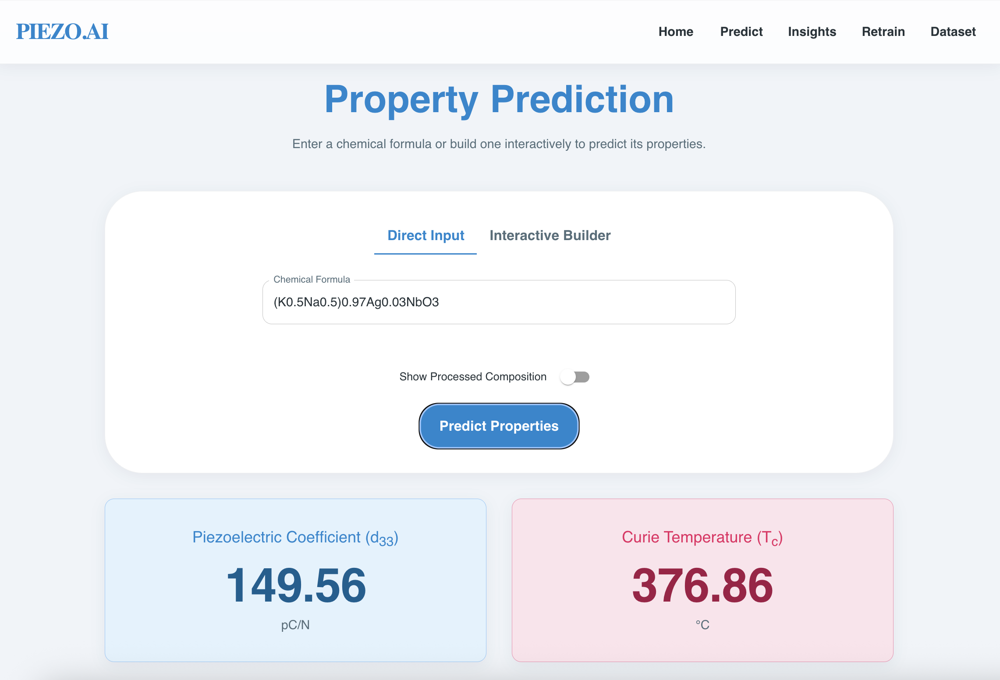
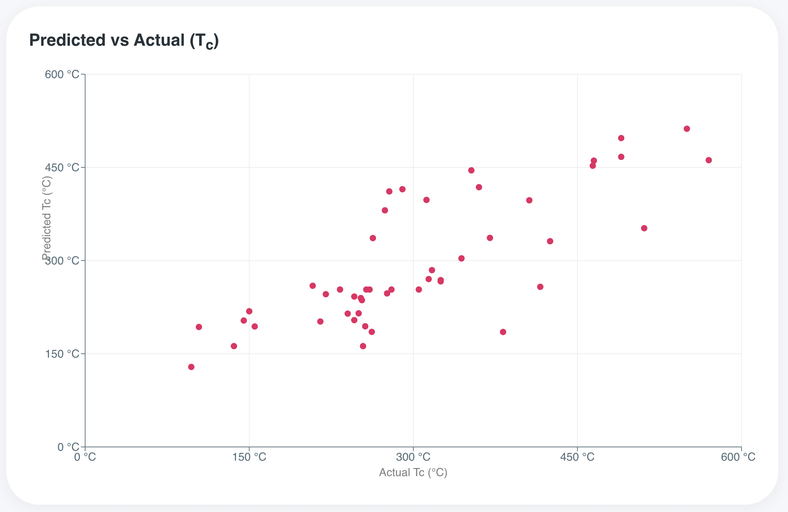
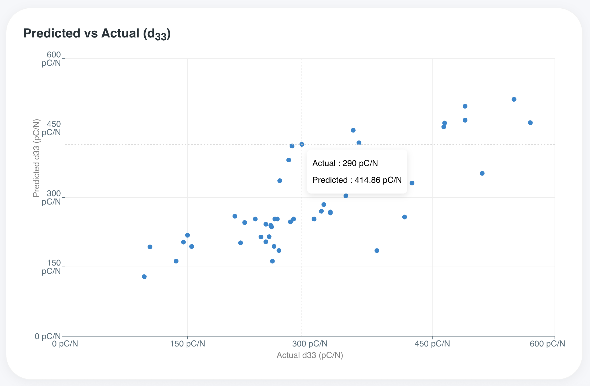
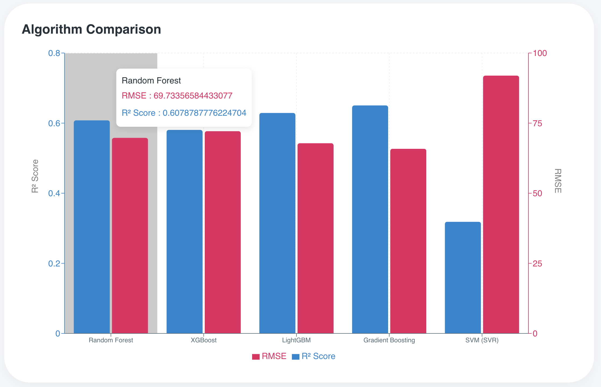

# 🧪 AI-Assisted Discovery of New Lead-Free Piezoelectrics


## 📖 Executive Summary

This project captures a complete **Materials Informatics Workflow**, designed to solve one of the most pressing challenges in materials science: finding eco-friendly alternatives to toxic lead-based electronics.

By engineering a full-stack **"Virtual Laboratory"**, this application accelerates the discovery of lead-free piezoelectric ceramics. It replaces **_months of costly, trial-and-error synthesis_** with instant, machine-learning-driven predictions, enabling researchers to screen thousands of complex chemical compositions in seconds.

**Key Impact:**

- **Acceleration:** Reduces material screening time from **weeks to milliseconds**.
- **Precision:** Achieves high predictive accuracy ($R^2 \approx 0.85$) for critical properties like Piezoelectric Coefficient ($d_{33}$) and Curie Temperature ($T_c$).
- **Usability:** Democritizes advanced ML models for non-computational experimentalists via an intuitive GUI.

---

## 🌍 The Problem: The "Lead Dilemma"

**Lead Zirconate Titanate (PZT)** powers nearly all modern piezoelectric devices (ultrasound, sensors, actuators).

However, PZT creates a significant global challenge:

- **Toxicity:** PZT contains >60% lead by weight, a neurotoxin that poses severe health risks.
- **Environmental Impact:** E-waste containing PZT leaches lead into soil and groundwater, causing long-term contamination.
- **Regulatory Pressure:** Global directives like **RoHS** are restricting the use of hazardous substances, creating an urgent need for eco-friendly alternatives.

Finding a replacement is an **optimization nightmare**:

1.  The search space for chemical solid solutions is effectively infinite.
2.  Complex stoichiometry (e.g., doping, substitution) makes traditional modeling difficult.
3.  Experimental synthesis is slow, expensive, and hazardous.

## 💡 The Solution

A comprehensive **Data-Driven Pipeline** that ingests raw chemical formulas and outputs validated property predictions. This project implements a **Data-Driven Workflow** to bypass traditional limitations:

1.  **Data Collection:** Aggregated data on lead-free ceramics (specifically KNN-based) from scientific literature.
2.  **Feature Engineering:** Developed a robust chemical parser to convert complex chemical formulas (including solid solutions and dopants) into numerical features.
3.  **Predictive Modeling:** Trained and compared multiple ensemble learning algorithms (XGBoost, Random Forest, LightGBM) to accurately predict material properties.
4.  **Web Application:** Wrapped the ML engine in a modern Full-Stack application, allowing researchers to easily test new compositions and retrain models with new data.
5.  **Deploy:** A production-grade web application serves these models to researchers globally.

---

## 🚀 Key Technical Features

### 1. 🧬 Advanced Stoichiometry Engineering

Unique to this project is a robust **Chemical Parsing Engine** capable of handling real-world, "messy" scientific notation.

- **Nested Formula Support:** Recursively resolves complex solid solutions like `0.96(K0.48Na0.52)NbO3-0.04(Bi0.5Ag0.5)ZrO3`.
- **Normalization:** Automatically balances stoichiometry and handles bracket variations (e.g., `[]` vs `()`) ensuring consistent feature generation regardless of user input style.
- **Feature Vectors:** Maps cleaned formulas to 28+ atomic descriptors (electronegativity, ionic radius, valence electron concentration) based on domain knowledge.
- **Dual-Target Prediction:** Simultaneously predicts:
  - **$d_{33}$:** Piezoelectric charge coefficient (pC/N).
  - **$T_c$:** Curie Temperature (°C).

### 2. 🧠 Adaptive Machine Learning Pipeline

The backend features a sophisticated, self-correcting ML engine (`ml_engine.py`):

- **Auto-Tune vs. Expert Control:**
  - **Auto-Mode:** Automatically runs Grid Search (CV=5) across Random Forest, XGBoost, LightGBM, SVR, and Gradient Boosting to find the optimal architecture.
  - **Manual Fine-Tuning:** Allows domain experts to override specific hyperparameters (e.g., `n_estimators`, `gamma`) for targeted experimentation.
- **Ensemble Stacking:** Implements a `StackingRegressor` that combines weak learners to minimize variance and improve generalization on small datasets.
- **Strict Parameter Sanitization:** A custom whitelist layer ensures model stability, preventing crashes when determining valid hyperparameters for different algorithms dynamically.

### 3. 📄 Automated Research Reporting

Bridging the gap between code and publication, the **PDF Reporting Engine** (`report_generator.py`) automates data storytelling:

- **Dynamic Visualization:** Generates publication-ready vector graphics (Scatter plots with "Perfect Fit" lines, RMSE comparison bar charts).
- **Contextual Insights:** Programmatically generates text summarizing "Best Performing Models" and "Model Certainty" based on training metrics.
- **Smart Layouts:** Uses advanced `Flowable` logic to prevent charts and titles from splitting across pages, ensuring professional formatting.

### 4. ⚡ Real-Time Interactive UI

Built with **React 18** and **Vite**, the frontend prioritizes responsiveness and scientific accuracy:

- **Formula Builder:** A specialized form component validating charge neutrality and chemical validity in real-time.
- **Live Training Feedback:** Web-socket style polling provides granular progress updates ("Preprocessing", "Benchmarking", "Optimizing") to the user.
- **Interactive Insights:** `Recharts`-powered graphs allow users to hover and inspect individual data points (e.g., outlier detection).

---

## 🛠️ Technology Stack

| Layer         | Technology                  | Usage                                                                               |
| :------------ | :-------------------------- | :---------------------------------------------------------------------------------- |
| **Frontend**  | **React.js, Vite**          | Component-based UI, fast HMR                                                        |
|               | **Material UI (MUI)**       | Enterprise-grade component library                                                  |
|               | **Recharts**                | Interactive data visualization                                                      |
|               | **Framer Motion**           | Physics-based animations                                                            |
|               | **Axios**                   | For seamless API communication.                                                     |
| **Backend**   | **FastAPI**                 | High-performance, async Python web server                                           |
| **ML / Data** | **scikit-learn**            | Pipeline construction, preprocessing, SVR, RF                                       |
|               | **XGBoost / LightGBM**      | Gradient boosting implementations                                                   |
|               | **pandas / numpy**          | Vectorized data manipulation                                                        |
|               | **chemparse**               | Stoichiometry parsing basis                                                         |
| **Reporting** | **ReportLab**               | Programmatic PDF generation                                                         |
|               | **Matplotlib, Seaborn**     | Scientific plotting                                                                 |
| **DevOps**    | **Docker & Docker Compose** | Containerizes both services for easy, consistent deployment across any environment. |

---

## 💻 Local Development Setup

### 1. Prerequisites

Before you begin, ensure you have the following installed:

- **[Git](https://git-scm.com/downloads):** For cloning the repository.
- **[Docker Desktop](https://www.docker.com/products/docker-desktop):** (Recommended) For running the application in containers.
- **[Python 3.9+](https://www.python.org/downloads/):** (For local backend development)
- **[Node.js v16+](https://nodejs.org/):** (For local frontend development)

### Installation

#### 1. **Clone the Repository**

    ```bash
    git clone https://github.com/tusaryan/Piezoelectrics-AI-Discovery-Lab.git
    cd Piezoelectrics-AI-Discovery-Lab
    ```

#### 2. Quick Start (With Docker)

This single command builds the full application (Frontend + Backend + DB) containers and sets up the network.
`bash
    docker-compose up --build
    `

- **App:** `http://localhost:3000`
- **API Docs:** `http://localhost:8000/docs`

#### 3. Manual Setup (Dev Mode)

##### 3.1. Backend Setup (FastAPI)

**Prerequisites:** Python 3.9+ installed.

**macOS / Linux:**

1.  Navigate to the backend directory:
    ```bash
    cd backend
    ```
2.  Create and activate a virtual environment:
    ```bash
    python3 -m venv venv
    source venv/bin/activate
    ```
3.  Install dependencies:
    ```bash
    pip install -r requirements.txt
    ```
4.  Start the server:
    ```bash
    uvicorn main:app --reload --port 8000
    ```

**Windows:**

1.  Open PowerShell or Command Prompt and navigate to the backend directory:
    ```powershell
    cd backend
    ```
2.  Create and activate a virtual environment:
    ```powershell
    python -m venv venv
    .\venv\Scripts\activate
    ```
3.  Install dependencies:
    ```powershell
    pip install -r requirements.txt
    ```
4.  Start the server:
    ```powershell
    uvicorn main:app --reload --port 8000
    ```

_The API will be available at `http://localhost:8000`._

##### 3.2. Frontend Setup (React)

**Prerequisites:** Node.js (v16+) and npm installed.

**All Platforms (macOS, Windows, Linux):**

1.  Open a new terminal window and navigate to the frontend directory:
    ```bash
    cd frontend
    ```
2.  Install dependencies:
    ```bash
    npm install
    ```
3.  Start the development server:

    ```bash
    npm run dev
    ```

    _The app will be available at `http://localhost:5173` (or the port shown in the terminal)._

4.  **Access the Application**
    - **Web App:** Open [http://localhost:3000](http://localhost:3000) in your browser.
    - **API Documentation:** Open [http://localhost:8000/docs](http://localhost:8000/docs) to see the Swagger UI.

---

## 🔬 Scientific Validation Methodology

To ensure valid scientific outputs, the model follows a rigorous validation protocol:

1.  **Data Cleaning:** Removal of non-stoichiometric entries and duplicate formulas.
2.  **Stratified Split:** 80/20 Train-Test split to preserve distribution of target properties.
3.  **Metric Evaluation:** Models are scored on **$R^2$** (variance explained) and **RMSE** (average error features).
4.  **Target Scaling:** Implementation of `TransformedTargetRegressor` to handle non-normal distributions in target variables ($T_c$, $d_{33}$).

_Example Visualization generated by the app:_

### Legacy UI Samples (For Illustration Only)

> **Note**: The screenshots below are from an older version of the application to illustrate the UI. The model accuracy shown in these images is lower due to older data in comparison to what is described above in the documentation.






> The system automatically plots predicted values against experimental values to visually confirm the model's accuracy on unseen data.

---

## 🔮 Future Roadmap

1.  **Inverse Design (Generative AI & Genetic Algorithms):**
    - Implementing Variational Autoencoders (VAEs) to _generate_ novel formulas with desired properties.
    - Use a Genetic Algorithm (GA) to _generate_ new, hypothetical compositions and evolve them to maximize $d_{33}$ and $T_c$.
2.  **Structure-Property Mapping (Deep Learning Integration):**
    - Integrating Crystal Graph Convolutional Networks (CGCNN) and Graph Neural Networks (GNNs) to learn directly from crystal lattice files (CIFs) and better capture crystal structure relationships.
3.  **Active Learning:**
    - A "Human-in-the-loop" system that suggests the next best experiment to perform to maximally improve model confidence.
4.  **Microstructure Analysis:**
    - Integrate Computer Vision (CNNs) to analyze SEM (Scanning Electron Microscope) images and correlate microstructure with piezoelectric performance.
5.  **Expanded Property Prediction:**
    - Add models for Dielectric Loss ($\tan \delta$), Planar Coupling ($k_p$), and Density ($\rho$).

---

## 📜 License

This project is licensed under the MIT License - see the [LICENSE](LICENSE) file for details.
