# Piezo.AI — Documentation & Gallery Appendix

This document operates as the extended technical and visual appendix to the main `Piezo.AI` repository. It contains comprehensive visual showcases of the Figma-inspired custom UI components, architectural references, and extended schema guidelines strictly removed from the primary `README.md` to ensure absolute conciseness.

## 🖼️ Primary Interface Gallery Showcase

Our frontend utilizes a draggable, collapsible, and customizable grid-layout to prevent interface bloat.

<div align="center">
  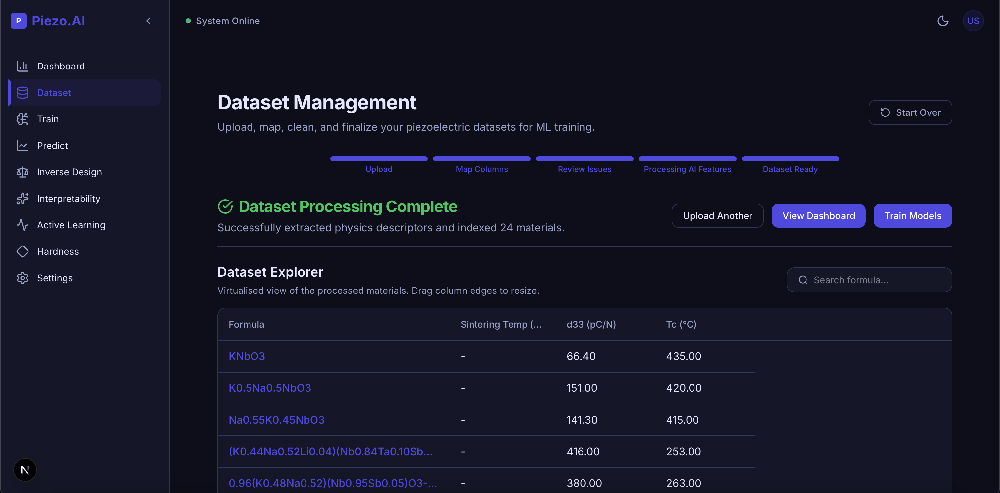
  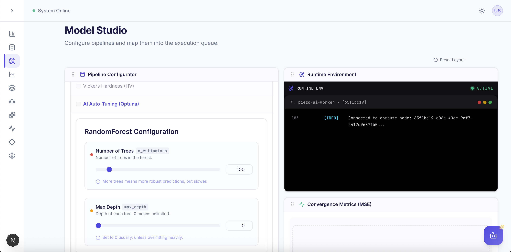
  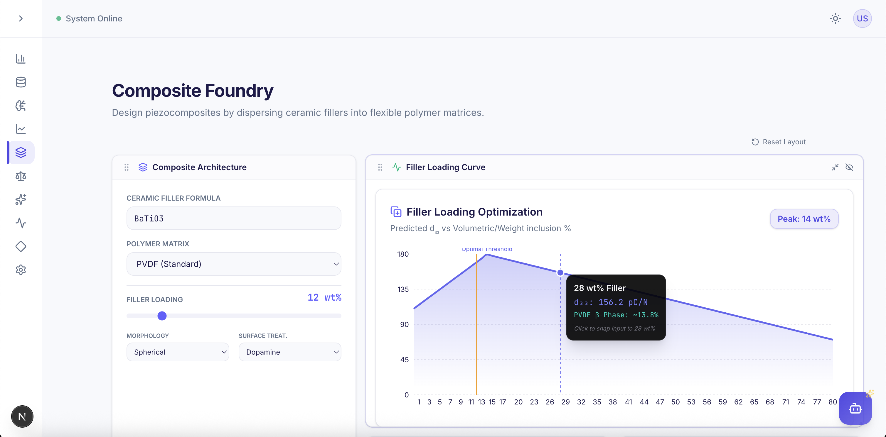
  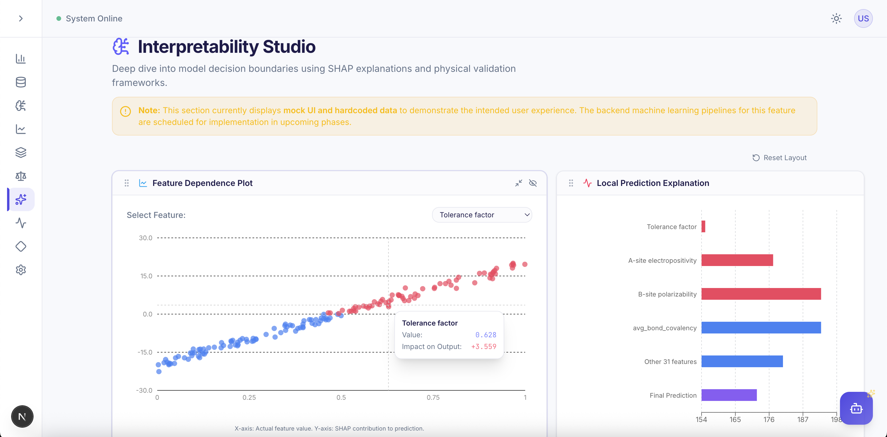
  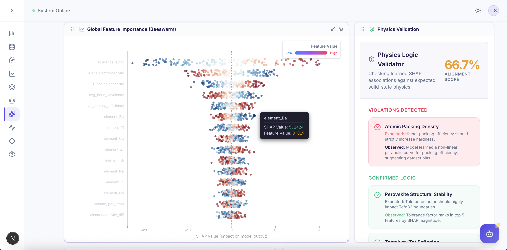
  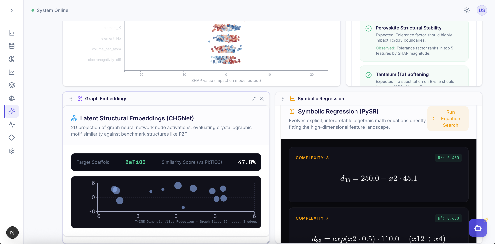
  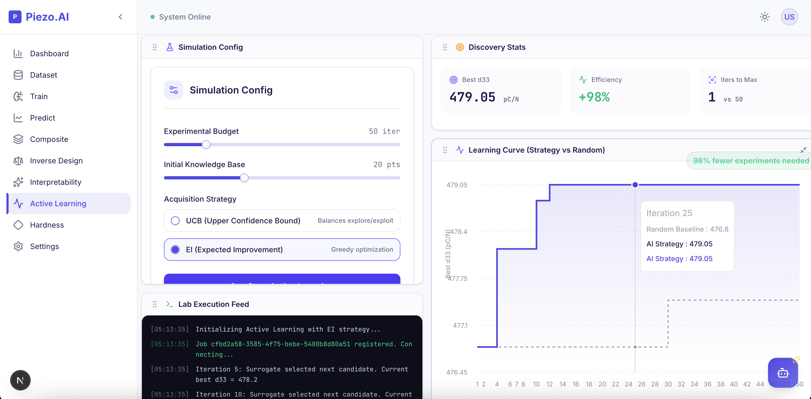
  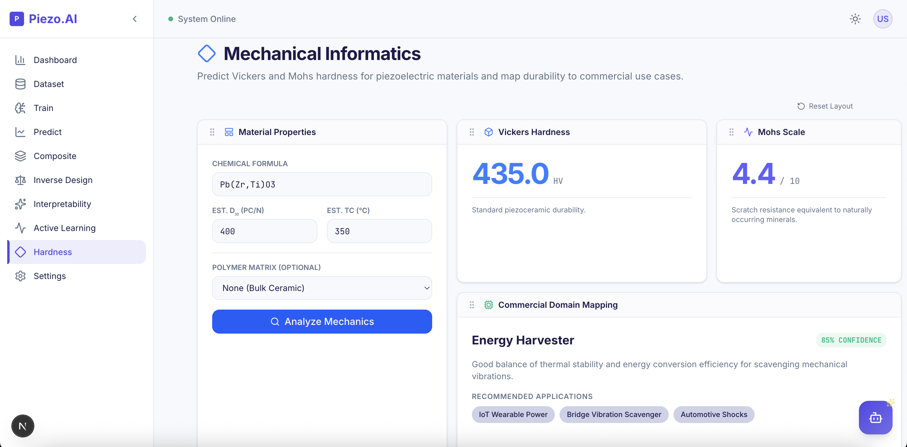
  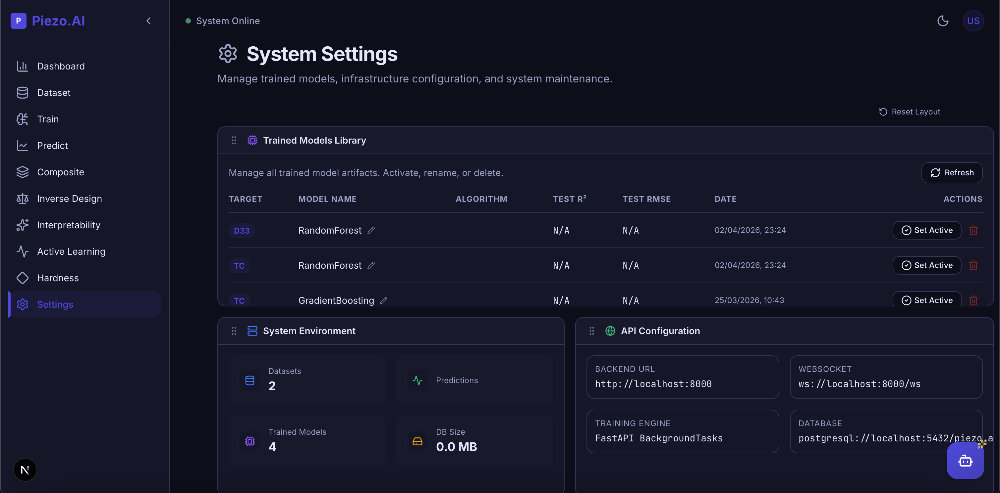
  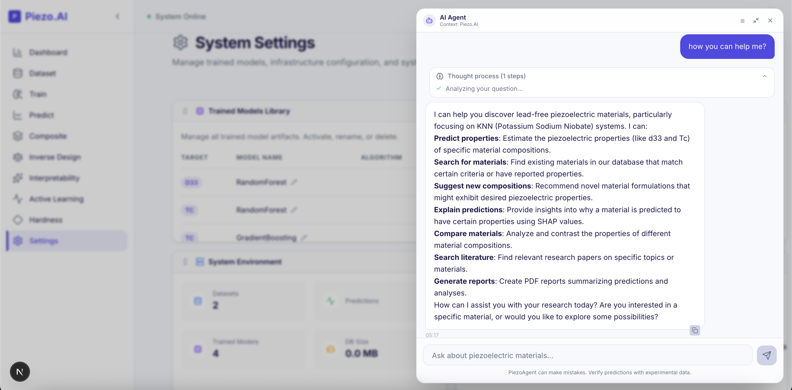
  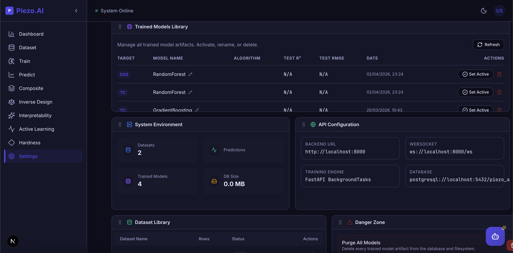
  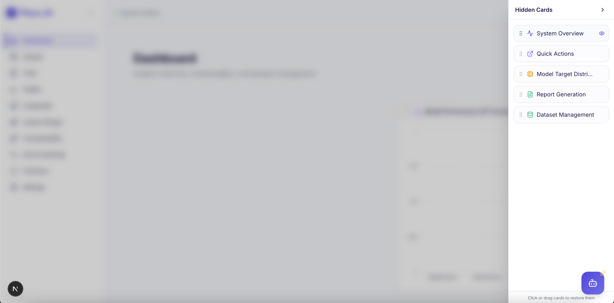
</div>

---

## 🗂️ Project Structure

```
Piezoelectrics-AI-Discovery-Lab/
├── apps/
│   ├── api/                    # FastAPI backend
│   │   └── app/
│   │       ├── core/           # Config, DB, error handling
│   │       └── modules/        # Feature modules
│   │           ├── training/   # ML training pipeline
│   │           ├── prediction/ # Property prediction
│   │           ├── dataset/    # Dataset management
│   │           ├── composite/  # PVDF composite predictions
│   │           ├── hardness/   # Hardness & use-case mapping
│   │           ├── interpret/  # SHAP interpretability
│   │           ├── inverse/    # Inverse design
│   │           └── active_learning/
│   └── web/                    # Next.js frontend
│       ├── app/                # Pages (App Router)
│       └── components/         # UI components
├── docs/                       # Comprehensive documentation & appendix
├── packages/
│   ├── db/                     # Database models & migrations
│   └── ml-core/                # ML pipeline (piezo_ml)
├── resources/                  # Sample datasets & Previews
│   ├── interface-previews/     # UI Screenshots
│   ├── sample_knn_basic.csv
│   ├── sample_knn_pvdf_composite.csv
│   └── sample_hardness_only.csv
├── scripts/                    # Dev utility scripts
│   └── dev.sh                  # setup, clean, db:reset, start
└── .env.example                # Environment template
```

---

## 📊 Dataset Guide

### Uploading Datasets

Navigate to the **Dataset** page in the web UI and upload a `.csv` file. The system automatically detects available columns and maps them to prediction targets.

### Supported Schemas

**Basic (d33 + Tc only):**

```csv
formula,d33,tc
KNbO3,66.4,435
K0.5Na0.5NbO3,151.0,420
```

**Extended (with Hardness):**

```csv
formula,d33,tc,vickers_hardness
KNbO3,66.4,435,510.0
K0.5Na0.5NbO3,151.0,420,480.0
```

**Full Composite Schema:**

```csv
formula,d33,tc,vickers_hardness,matrix_type,filler_wt_pct,particle_morphology,particle_size_nm,surface_treatment,fabrication_method
K0.5Na0.5NbO3,58.0,118,32.0,pvdf,15.0,spherical,80,silane,solvent_cast
```

### Column Reference

| Column                | Type   | Required              | Description                                     |
| --------------------- | ------ | --------------------- | ----------------------------------------------- |
| `formula`             | string | ✅                    | Chemical composition (supports solid solutions) |
| `d33`                 | float  | For d33 training      | Piezoelectric coefficient (pC/N)                |
| `tc`                  | float  | For Tc training       | Curie temperature (°C)                          |
| `vickers_hardness`    | float  | For hardness training | Vickers hardness (HV)                           |
| `matrix_type`         | string | For composites        | Polymer matrix: `pvdf`, `pvdf_trfe`, `epoxy`    |
| `filler_wt_pct`       | float  | For composites        | Ceramic filler weight % (0-80)                  |
| `particle_morphology` | string | For composites        | `spherical`, `rod`, `platelet`                  |
| `particle_size_nm`    | float  | For composites        | Average particle size in nm                     |
| `surface_treatment`   | string | For composites        | `untreated`, `silane`, `plasma`                 |
| `fabrication_method`  | string | For composites        | `solvent_cast`, `electrospinning`, `hot_press`  |

### Sample Datasets

Pre-made sample files are in `resources/` for quick testing:

- `sample_knn_basic.csv` — 20 KNN compositions with d33 and Tc
- `sample_knn_pvdf_composite.csv` — Bulk + composite data with all fields
- `sample_hardness_only.csv` — 15 compositions with Vickers hardness

---

## 🔧 Dev Utility commands and Database Resilience

The `scripts/dev.sh` utility is heavily engineered for resilience, automatically protecting you from typical environment and container issues.

```bash
bash scripts/dev.sh setup      # Setup dev environment (prompts for Docker vs Local DB)
bash scripts/dev.sh setup:all  # Full fresh setup (wipes caches, node_modules, and .venv first)
bash scripts/dev.sh clean      # Remove node_modules, .next, __pycache__, .venv
bash scripts/dev.sh start      # Starts servers (verifies DB health & revives paused containers natively)
bash scripts/dev.sh stop       # Deeply shuts down Background Next.js/FastAPI components cleanly
bash scripts/dev.sh db:create  # Create the database manually
bash scripts/dev.sh db:migrate # Run Alembic migrations manually
bash scripts/dev.sh db:reset   # Drops DB, recreates, and runs migrations (for safe data clearing)
bash scripts/dev.sh db:seed    # Show info about sample datasets
```

**Robust Capabilities & Customizations:**

- **Local Port Cleaning Override**: Explicit trap integration via `cmd_stop` cleanly maps all `Ctrl+C` terminal interactions and executes `lsof/kill -9` commands natively to instantly prevent standard orphaned ghost instances over TCP ports `3000`/`8000`.
- **Intelligent Container Recovery**: If Docker is selected and the structural database container crashes, drops, or enters an explicitly `paused` state, `dev.sh start` detects the failure via `pg_isready` and automatically issues revival commands (`unpause` / `start`) before launching the backend.
- **Fail-safe Schema Migrations**: Should backend Alembic migrations fail due to structural corruption or incompatible historical schemas, the script intercepts the crash and presents a graceful prompt to execute a complete **Hard Reset** (safely wiping the corrupt database, recreating tables, and bootstrapping).
