# Interface Gallery

> All 22 interface screenshots with detailed descriptions mapping each view to its corresponding platform feature.

**← [Back to Developer Guide](DEVELOPER_GUIDE.md)**

> **Note:** All screenshots are located in `resources/interface-previews/`. Images referenced below use relative paths from the repository root.

---

## Dashboard

### Preview 1 — Dashboard Overview (Dark Mode)

The main dashboard with draggable/resizable cards showing platform statistics, quick-action buttons, and dataset summaries. The glassmorphic sidebar provides navigation to all 7 sections. Status indicator shows "Online" when the backend is connected.

### Preview 2 — Trained Models & Report Generation
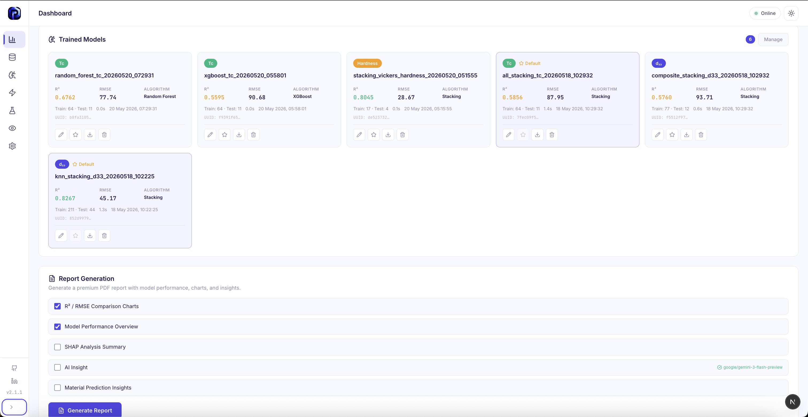

Dashboard model cards showing all 6 trained models with R² scores, RMSE, algorithm type, training timestamps, and train/test split info. Each card has action buttons: edit, set as default (star), download .joblib, and delete. Below is the Report Generation panel with selectable sections (R²/RMSE Charts, Model Performance, SHAP Summary, AI Insight, Material Predictions).

---

## Dataset

### Preview 3 — Dataset Upload Wizard (Step 2: Column Mapping)
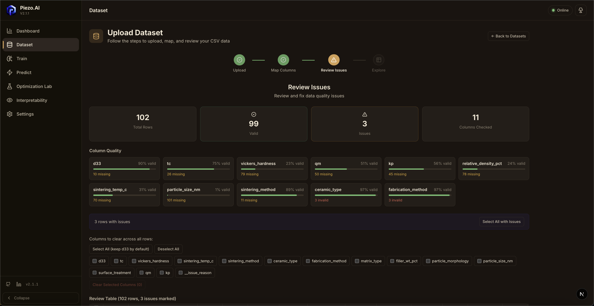

The column mapping step of the dataset upload wizard. Users map CSV columns to internal schema fields (formula, d₃₃, Tc, etc.). Auto-detection pre-fills matches. Unmapped columns are ignored during processing.

### Preview 4 — Review Table (Step 3: Issue Review)
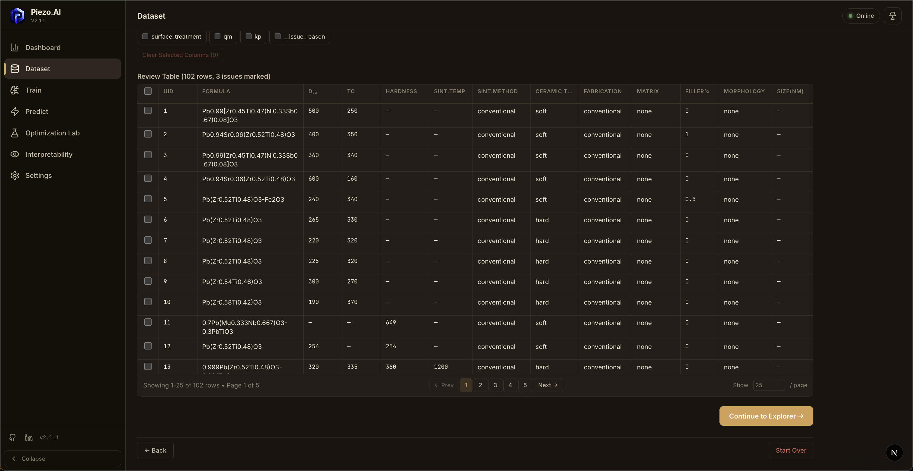

Full data table with 102 rows showing all mapped columns including composite fields (Ceramic Type, Fabrication, Matrix, Filler%, Morphology, Size). Column selection checkboxes at top for bulk clearing. Pagination with 25 rows per page. "Continue to Explorer" button proceeds to final step.

---

## Model Studio (Train)

### Preview 5 — Training Pipeline Overview
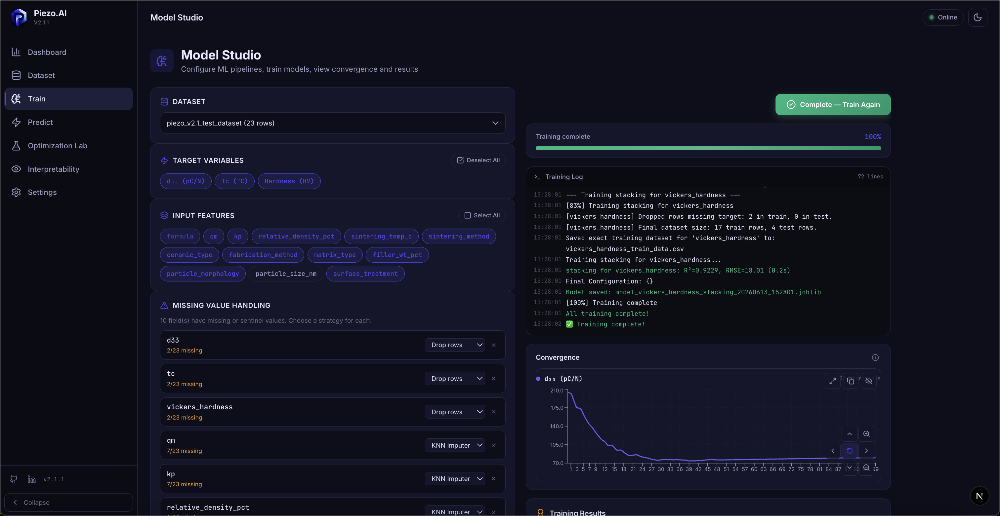

Full training page showing: (1) missing value strategies per column with dropdown selectors, (2) live convergence chart tracking d₃₃ loss across boosting rounds, (3) real-time training results with R² and RMSE per target, and (4) algorithm selection in "Per-Target" mode (XGBoost for d₃₃, Random Forest for Tc, Stacking for Hardness).

### Preview 6 — Missing Value Handling + Results
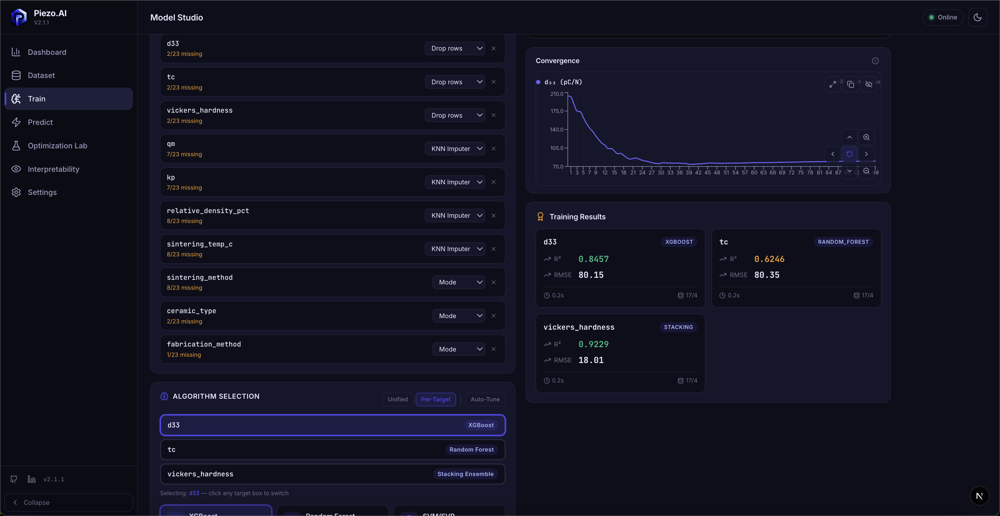

Close-up of: missing value strategy selection (Drop Rows for targets, KNN Imputer for numeric features, Mode for categorical), the convergence chart for d₃₃, and training result cards showing R²=0.8457/XGBoost, R²=0.6246/Random Forest, R²=0.9229/Stacking across the three targets.

### Preview 7 — Algorithm Card Selection
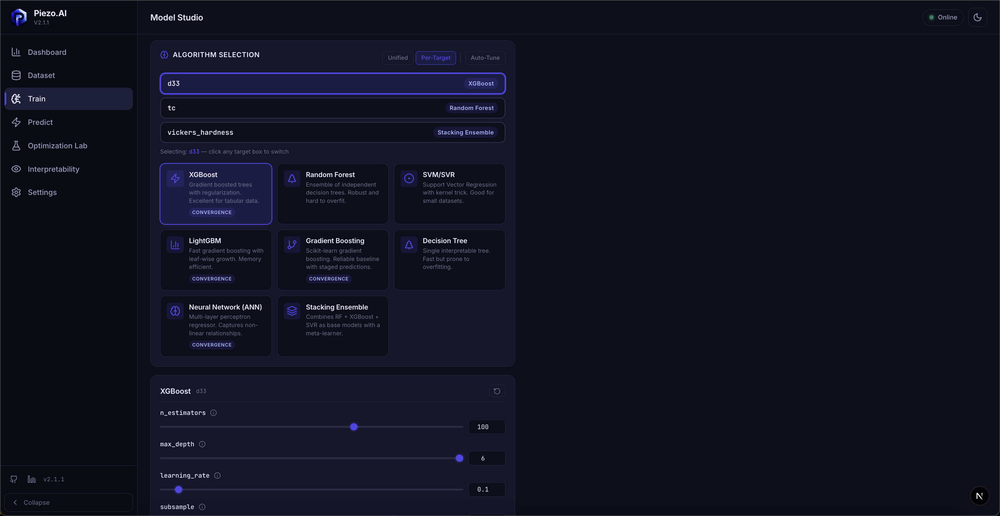

Scrollable algorithm selection grid showing all 8 algorithm cards (XGBoost, Random Forest, LightGBM, Gradient Boosting, SVR, Decision Tree, Neural Network, Stacking Ensemble). Each card displays the algorithm name and category. Three mode tabs visible: Unified, Per-Target, Auto-Tune.

### Preview 8 — Hyperparameter Sliders
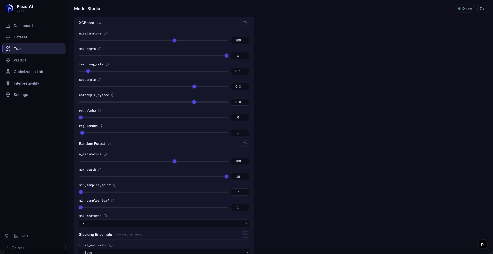

Detailed hyperparameter tuning interface in Per-Target mode. XGBoost sliders for d₃₃ (n_estimators, max_depth, learning_rate, subsample, colsample_bytree, reg_alpha, reg_lambda). Below: Random Forest parameters for Tc (n_estimators, max_depth, min_samples_split, min_samples_leaf, max_features). Stacking Ensemble for Hardness visible at bottom.

---

## Predict

### Preview 9 — Single Prediction with Results
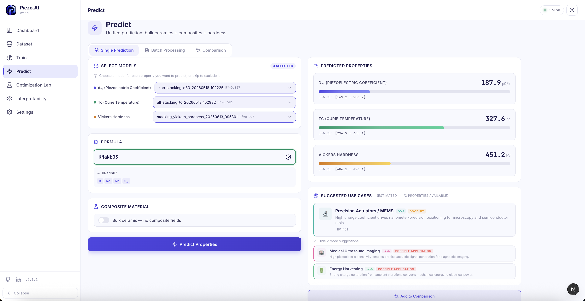

Prediction page showing: model selector per target (d₃₃=stacking R²=0.827, Tc=stacking R²=0.586, Hardness=stacking R²=0.923), formula input with live validation (KNaNbO₃ → ✓), predicted properties (d₃₃=187.9 pC/N, Tc=327.6°C, HV=451.2), 95% confidence intervals, and suggested use cases (Precision Actuators/MEMS 55% "Good Fit", Medical Ultrasound 33%, Energy Harvesting 33%).

---

## Optimization Lab

### Preview 10 — Crystal Structure Analysis (Single)
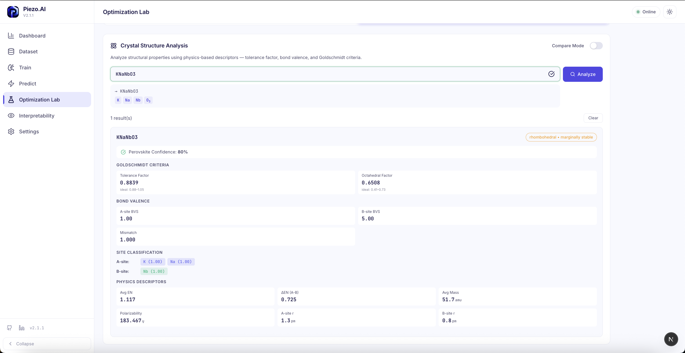

Structure Analysis tab showing KNaNbO₃ analysis: Perovskite Confidence 80%, Goldschmidt Criteria (tolerance factor=0.8839, octahedral factor=0.6508), Bond Valence (A-site=1.00, B-site=5.00, Mismatch=1.000), Site Classification (A: K, Na | B: Nb), and Physics Descriptors (Avg EN, ΔEN, Avg Mass, Polarizability, A-site/B-site radii). Crystal structure badge: "rhombohedral • marginally stable".

### Preview 11 — Crystal Structure Comparison Mode
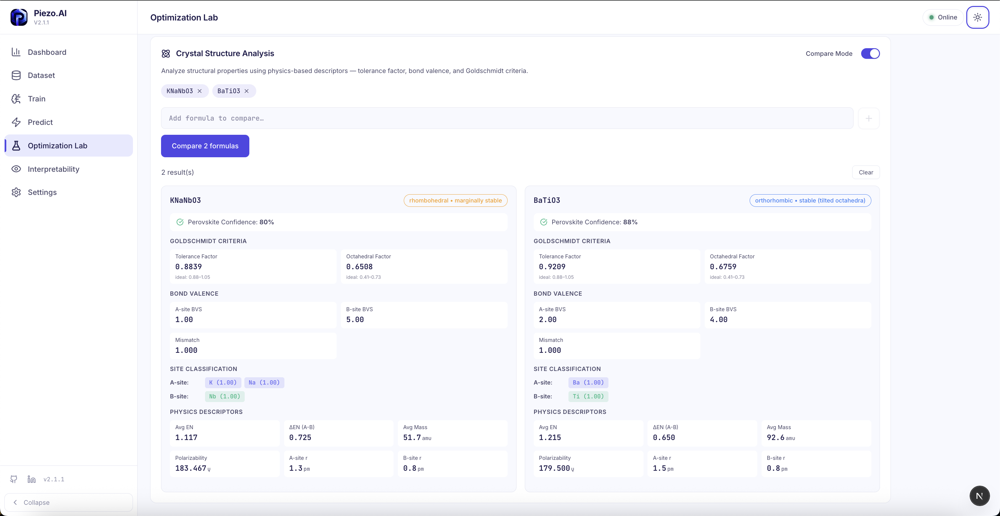

Compare Mode enabled with side-by-side analysis of KNaNbO₃ vs BaTiO₃. Shows differences in tolerance factor (0.8839 vs 0.9209), octahedral factor (0.6508 vs 0.6759), bond valence, and physics descriptors. BaTiO₃ classified as "orthorhombic • stable (tilted octahedra)" with higher perovskite confidence (88%).

### Preview 12 — NSGA-II Pareto Front

3D Pareto front visualization showing optimized compositions plotted on d₃₃ vs Tc axes, with color-coded use-case tags. Interactive scatter plot with hover tooltips showing exact formula + predicted properties. Side panel shows top Pareto-optimal compositions in ranked order.

### Preview 13 — Optimization Results + Convergence
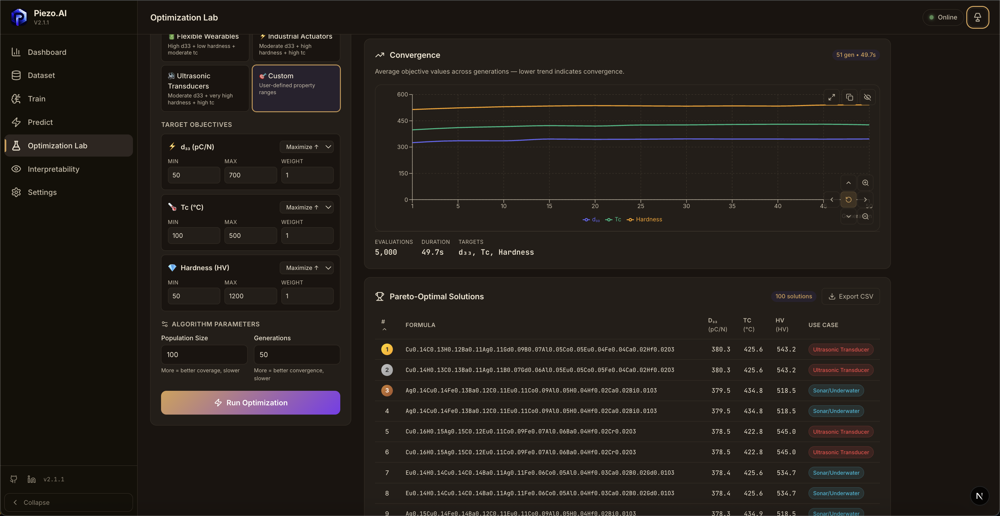

Full optimization results view: use-case presets (Flexible Wearables, Industrial Actuators, Ultrasonic Transducers, Custom), target objectives with min/max/weight sliders, algorithm parameters (Population=100, Generations=50), convergence chart (51 gen, 49.7s), and Pareto-Optimal Solutions table (100 solutions) with formulas, predicted d₃₃/Tc/HV values, and use-case tags (Ultrasonic Transducer, Sonar/Underwater). Export CSV button.

---

## Interpretability

### Preview 14 — SHAP Beeswarm Plot
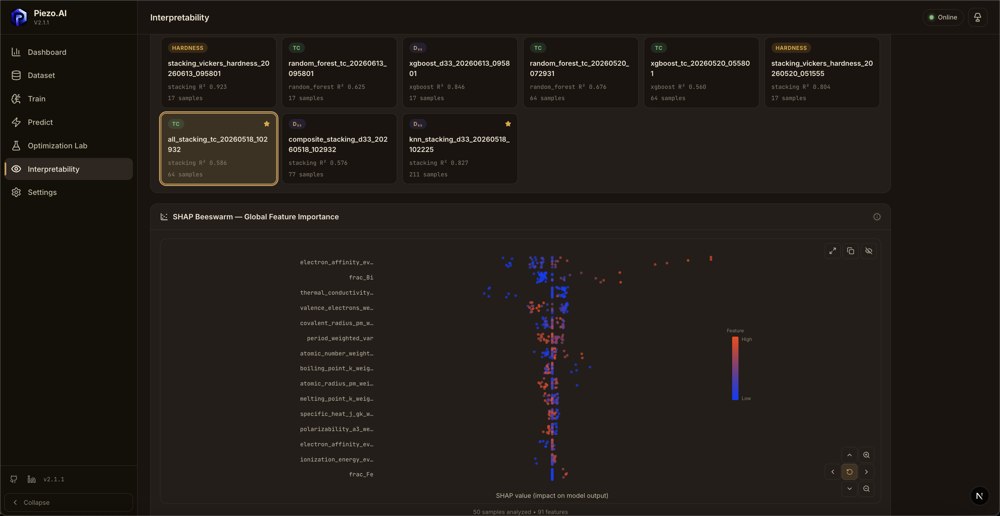

Interpretability page showing: model selector cards (9 models with R², algorithm, sample count), selected model highlighted in green, and SHAP Beeswarm plot with top-15 features ranked by importance. Features include electron_affinity, frac_Bi, thermal_conductivity, valence_electrons, covalent_radius. Color gradient from blue (low) to red (high) indicates feature value. 50 samples analyzed across 91 features.

### Preview 15 — SHAP Waterfall Plot
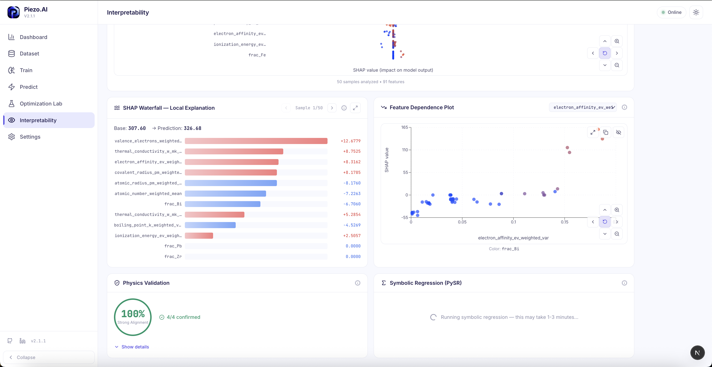

Waterfall decomposition of a single prediction showing contribution of each feature to the final predicted value. Base value → individual feature pushes (positive/negative) → final prediction. Sample navigator (1/50) for browsing individual explanations.

---

## Settings

### Preview 16 — Settings Overview
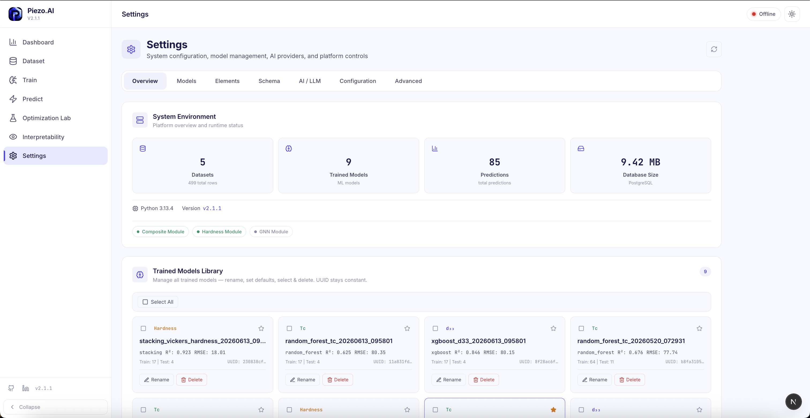

Settings page with tabbed navigation (Overview, Models, Elements, Schema, AI/LLM, Configuration, Advanced). System Environment section showing: 5 Datasets (499 rows), 9 Trained Models, 85 Predictions, 9.42 MB Database Size. Python 3.13.4, Version v2.1.1. Feature module indicators (Composite ✓, Hardness ✓, GNN ○). Trained Models Library with rename/delete actions.

### Preview 17 — AI/LLM Configuration
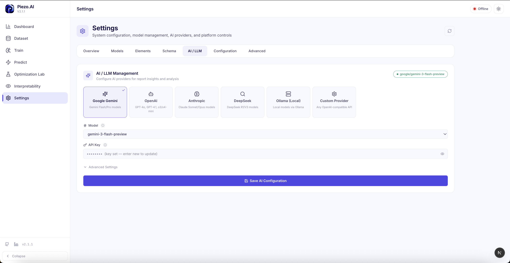

AI/LLM Management tab with provider cards: Google Gemini (selected, green checkmark), OpenAI, Anthropic, DeepSeek, Ollama (Local), Custom Provider. Model selector (gemini-3-flash-preview), API Key field (masked), and Advanced Settings expandable. "Save AI Configuration" button. Current active model shown as badge: "google/gemini-3-flash-preview".

### Preview 18 — App Configuration
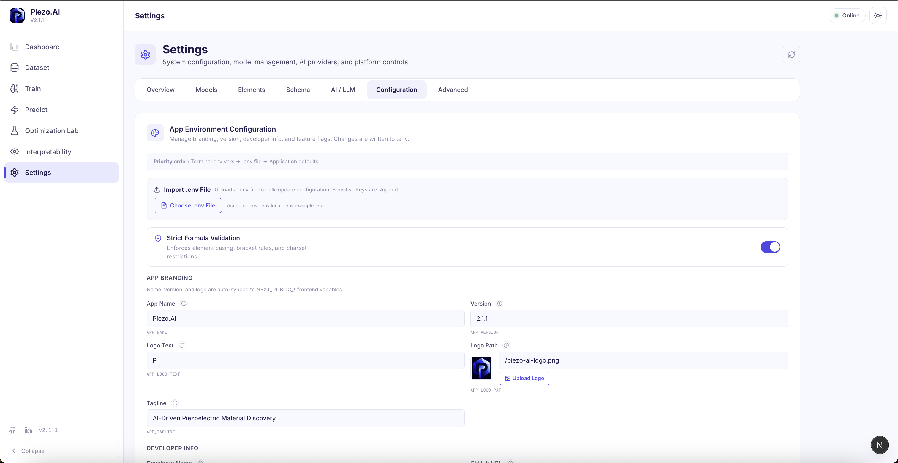

Configuration tab showing: .env file import functionality, Strict Formula Validation toggle (enabled), App Branding section (App Name, Version, Logo Text, Logo Path with preview + upload, Tagline), Developer Info section. Priority order indicator: "Terminal env vars → .env file → Application defaults".

### Preview 19 — Element Registry
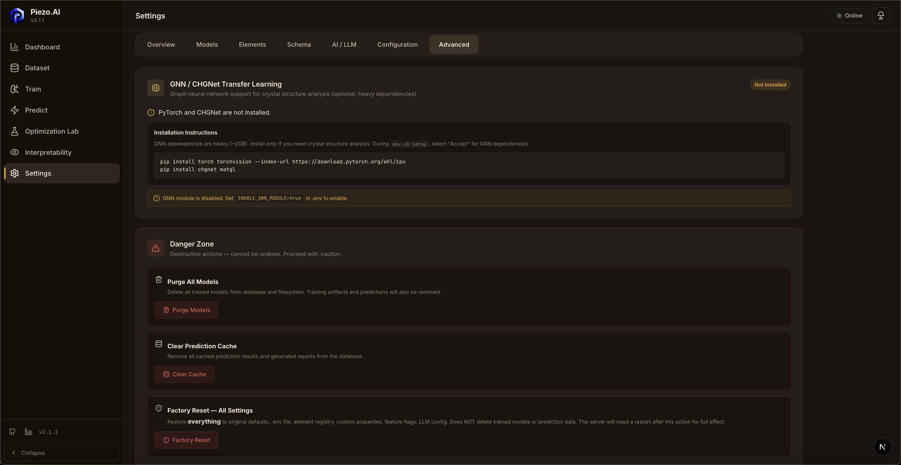

Elements tab displaying the full 42-element registry table with editable properties per element. Each row shows the element symbol, perovskite site classification, and key physics properties. Add/edit/delete functionality for managing the registry.

### Preview 20 — Field Schema Manager
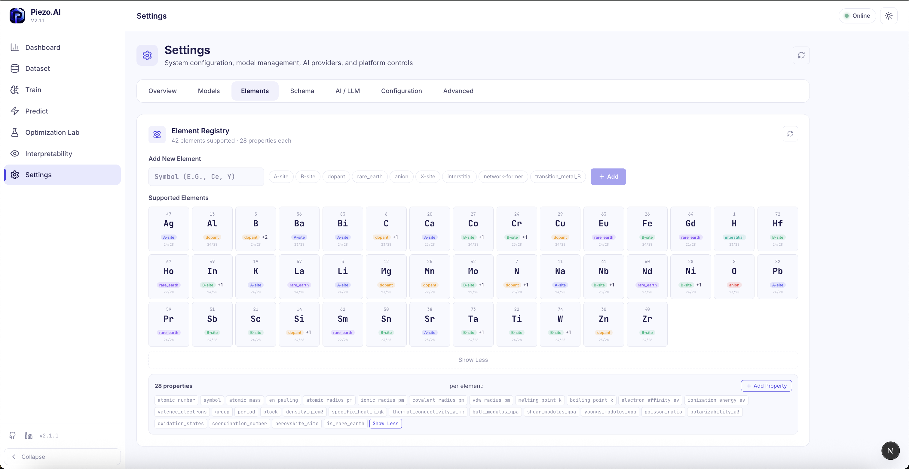

Schema tab for managing field definitions and valid categorical options. Shows configurable field types, required/optional status, and valid value sets for categorical columns like ceramic_type, fabrication_method, sintering_method.

### Preview 21 — Advanced Settings
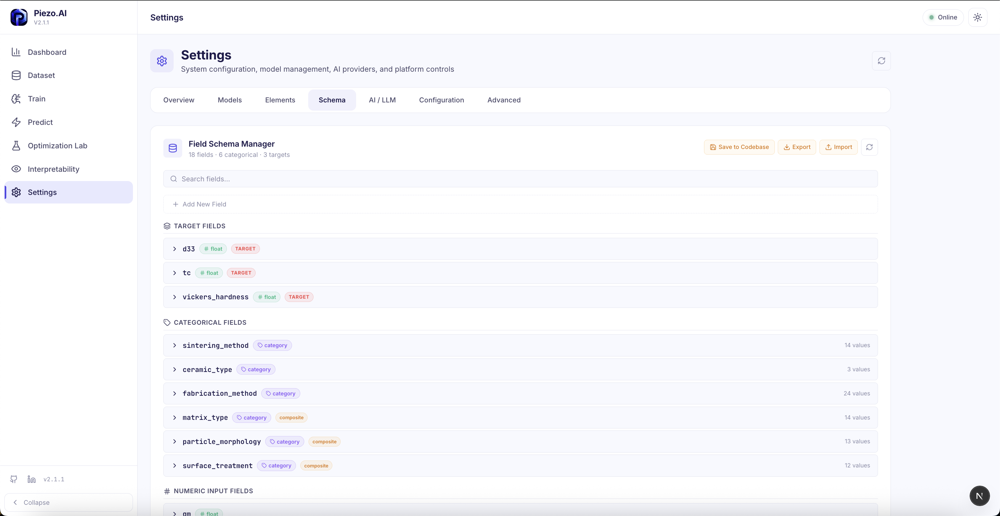

Advanced settings tab with system-level controls for ML limits, model storage management, and diagnostic tools. Shows database connection status, model artifact paths, and cache management options.

### Preview 22 — Settings Mobile / Additional View
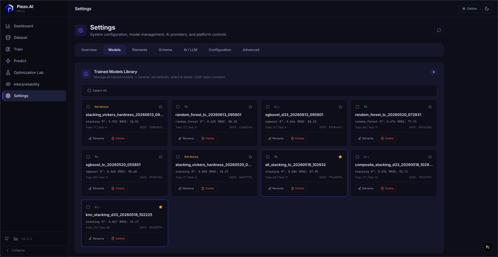

Additional settings view showing theme selection (Light/Dark/Night modes), ML configuration options, and system diagnostics output. Demonstrates the polished dark-mode aesthetic with purple accent colors and glassmorphic card effects.

---

## Theme Comparison

The platform supports three visual themes:

| Theme | Style | Best For |
|-------|-------|---------|
| **Light** | Clean white backgrounds, high contrast | Daytime use, presentations, screenshots |
| **Dark** (default) | Deep blue-gray backgrounds, purple accents | Extended research sessions, reduced eye strain |
| **Night** | Pure black backgrounds, minimal color | OLED displays, maximum contrast, late-night work |

---

**← [Features Guide](FEATURES_GUIDE.md)** | **Next: [Troubleshooting →](TROUBLESHOOTING.md)**
